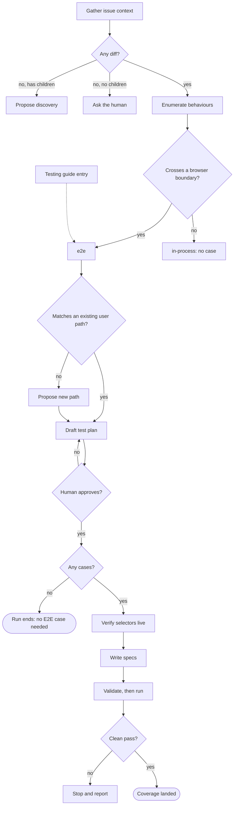
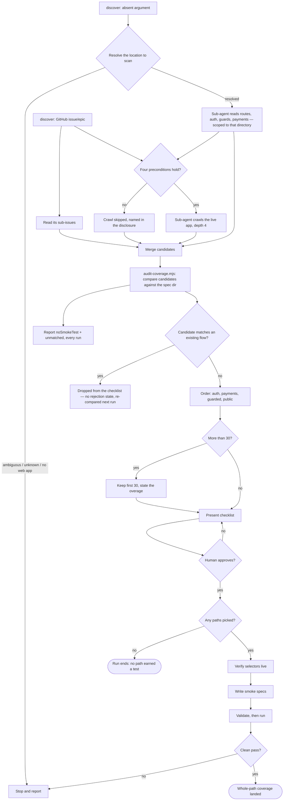

# E2E test generation

How one issue's change becomes end-to-end test coverage: gather the
issue's context, decide which of its behaviours need a browser to
exercise, get a human to approve that plan, then write and run Playwright
specs against the real app. This is `generate`; it is scoped to one issue
at a time, never the whole repo, and it usually runs during implementation
— once there is a diff to read, before or alongside the draft PR that
[`dev-flow`](https://github.com/apptension/toolkit-dev/blob/main/docs/sdlc/dev-flow.md)
opens. A ticket with no diff yet is not a dead end: it is routed rather
than stopped (see "When there is no diff" below).

A sibling entry point, `discover` (see "Proposing paths with no ticket at
all" below), covers the opposite case: no ticket, sometimes no diff
anywhere in the repo, and the question is which user paths the app even
has. Where this stops at "one issue's behaviours," `discover` reads the
whole app's routes, auth, guards and payment modules.

## Pointing the stage at a ticket

The stage takes one ticket reference, recognised by its shape — nothing
infers it from the branch, the last commit, or an open PR, because a wrong
ticket silently generates specs for the wrong change and review will not
catch it:

- a bare number is a GitHub issue;
- a URL resolves to a GitHub issue (host `github.com`, path
  `/owner/repo/issues/N`) or a Jira key (`/browse/KEY`); a URL that
  resolves to neither — or that points at a different repository or Jira
  instance than the one in play — is refused, not guessed at;
- an `UPPER-123` token is a Jira key;
- a lowercase kebab-case token is a user path (recognised, not yet acted
  on);
- an absent argument stops the stage.

GitHub tickets are read with `gh`; Jira tickets are read over the
Atlassian MCP, since the gathering script speaks only `gh` and `git`. The
diff is tracker-agnostic, so everything downstream is the same once the
ticket body and the diff are in hand — including spec writing, which
carries the ticket verbatim in each spec's provenance line, whether it is
a GitHub number or a Jira key.

### When there is no diff

A ticket with no diff — no local changes and no linked PR — is not a dead
end. Nobody commits code to an epic, so the stage tells an epic from a
not-yet-started task by whether the ticket has children (GitHub
sub-issues, or a Jira Epic / child issues, behind one shared rule): with
children it proposes running `discover <ticket>` to break the epic down
(see below); with none it asks the human.

## What the stage reads, and what it reads it for

Three inputs, all of them **context for writing a better plan**:

- **the ticket body**, including its acceptance criteria and its
  `## Testing guide` section if one is attached;
- **the diff** for the issue — a local diff against the detected base
  branch, falling back to the issue's linked pull request;
- **the changed unit tests** in that diff.

The unit tests earn their place by what they teach: the domain vocabulary
the team actually uses, the business rules spelled out as assertions, and
the edge cases whoever wrote them had already worked out. An edge case
asserted in a changed test and named in no acceptance criterion is a
behaviour this issue changes, so it is enumerated like any other and
judged by the same criterion below.

None of the three is a filter. **No step drops a candidate case because a
unit test exists.**

## The one criterion

A behaviour earns an E2E case when exercising it end to end crosses a
boundary only a browser can cross. The judgement is recorded per
behaviour as `classification`, and it has exactly two values.

`e2e` — walking the behaviour from the user's side has to leave the
process the code under test runs in. Any one of these is enough:

- the UI and the network together: a click or a submit that issues a
  request and renders from the response;
- more than one page or route, including a real redirect;
- authentication or session state: logging in, staying logged in, being
  turned away;
- persistence: state that has to survive a reload, or be visible on a
  second page;
- something the browser itself owns: cookies, storage, history, a file
  download or upload, a new tab.

`in-process` — the whole of the behaviour can be exercised without a
page: a pure function, a reducer, a formatter, a validator called in
isolation, a type or config change with no rendered consequence.

Every enumerated behaviour gets a verdict, including the `in-process`
ones. Judging *after* enumerating rather than while doing it is what
keeps the enumeration honest — a step that filters as it lists tends to
list less — and it leaves a record of what was considered and passed
over.

**The presence or absence of a unit test never enters the judgement.** A
behaviour that crosses a browser boundary earns a case whether or not
someone wrote a unit test for it, in this diff or anywhere else. A
behaviour that crosses none earns no case even when nothing tests it at
all.

When the diff genuinely leaves the call open — the behaviour could be
either, depending on wiring the diff doesn't show — the verdict is `e2e`,
with the uncertainty stated. An unnecessary case costs the human one line
to strike at the approval gate; a missing one is invisible.

## Playwright must be installed before a plan is drafted

This check is skipped entirely when no diff exists yet, or when the
judgement above produced no `e2e` entries. That path already ends the run
successfully with no app or Playwright involved (see "Approving an empty
plan ends the stage there, successfully" below) — a backend-only change or
a pure refactor never needs either, so nothing here should stop it. The
skip is provisional: an add request during revision (see "From judgement
to plan" below) can give an originally empty draft its first case, and
that is what re-runs this check, before the revised draft goes back to the
human.

Otherwise, before a plan is drafted or presented for approval — and so
before the stage ever boots or attaches to the target app — it confirms
Playwright is actually installed somewhere in the target repo. The check
reuses the same location-resolution logic the later spec-validation and
spec-run steps already use, rather than a second detection: it asks only
whether *any* location has `@playwright/test` installed, leaving which one
to those later steps, which already know the real spec paths needed to
disambiguate between several installs.

When nothing has it installed, the stage stops immediately: no plan is
drafted or presented, the app is never booted, and the Playwright MCP is
never opened. It points the human at `e2e-setup` to install it instead.
Any other outcome continues the run as before, unaffected. The narrower
check inside spec validation, later in the run, still runs on every
invocation — a fallback for an install that changes mid-run, after the
plan is already approved.

## From judgement to plan

Only `e2e` entries become cases. An `in-process` entry becomes no case
and does not appear in the draft plan.

The draft is presented to a human as a markdown checklist, one entry per
case, each carrying the acceptance criterion or diff area it traces to
and the boundary that earned it. Nothing is written to disk before
approval, and an empty plan goes through the same gate rather than being
auto-finalized: it is stated as a sentence explaining *why* it is empty,
not returned as a bare empty list.

**Approving an empty plan ends the stage there, successfully.** A diff
where every behaviour was judged `in-process` — a backend-only change, a
pure refactor — needs no browser at all, so the app is never booted and
no spec is written or run for it. This is a normal, deliberate outcome,
not a shortened or incomplete run.

Feedback at the gate is scoped to this issue. Drop and reword requests
are always honoured. An add request is honoured when it traces to this
issue's own diff or acceptance criteria — including a behaviour the
judgement called `in-process` that the human knows crosses a boundary the
diff didn't show. Genuinely under-tested code elsewhere is refused with a
note that it belongs in its own issue.

An add request that gives an originally empty draft its first case
re-triggers the Playwright presence check above — the one that skipped
because the judgement started with no `e2e` entries — before the revised
draft goes back to the human. It runs only that once; a later add request
to a draft that already carries a case needs no repeat.

A `## Testing guide` section in the ticket body is merged **additively
only**: it can append behaviours the steps above didn't produce, and can
never change or remove an entry already produced — not even one the guide
claims needs no E2E case.

A behaviour appended this way earns a case **without being judged against
the browser-boundary criterion above.** This is a deliberate override, not
the criterion applied and happening to agree: naming a behaviour in the
Testing guide is a human (or the `dev-flow` step that writes the guide)
saying directly that it needs E2E coverage, the same trust an "add"
request already gets at the approval gate. A guide entry for a behaviour
that turns out to be purely in-process still gets a case, on the strength
of the guide having named it.

## Every case gets a user path before it's written

A directory under the spec dir names a **user path** — `auth`, `cart`,
`checkout` — not a ticket. The point is additive: a ticket appends a case
to a path that already exists, rather than opening its own directory
named after itself. Left unchecked, that is what happens by default —
every ticket has its own number, and a generator that used it would
rebuild the exact per-ticket sprawl the path layout replaced, just one
level deeper.

So before a case is drafted, it is matched against the flow directories
that already exist under the target repo's spec dir, read together with
the spec filenames already inside each one — the filenames carry the
product vocabulary a bare directory name doesn't, which is usually enough
to place a case without opening any file. A case that matches nothing
proposes a new path instead, named from the vocabulary the plan itself
already uses for the behaviour — never from the ticket title or the
branch name, both of which name the ticket, not the path.

A proposed new path is approved inside the same plan-approval gate the
rest of the draft goes through, marked so the human can see it's new —
never a second question of its own. Rejecting it without naming an
alternative drops that case from the plan, with a one-line reason,
rather than writing it to a guessed directory. The path name itself is
validated as plain kebab-case before it can appear in the draft, because
the step that actually writes the file to disk refuses anything else
outright, after the plan is already approved — a rejection that late
would waste the approval the draft just asked for.

## Setup asks once, and persists the answer

`e2e-setup` settles the suite location, the test convention, the auth
scheme, the linter, and the TypeScript version to pin, through one approval
gate, run once per repo. It proposes defaults from discovery — the location
an existing `playwright.config` or the detector reveals, else `e2e/web`;
self-contained specs by default; basic auth when the repo's env already
declares `E2E_BASIC_AUTH_USER`, else email-and-password; the repo's own
linter (`eslint` / `biome` / `none`) as the detector reports it; the repo
root's declared `typescript` version, or no pin when the repo declares
none — then shows a summary naming the resolved absolute destination
(`Suite location: e2e/web → will be created at <abs path>/e2e/web`) for the
human to approve or edit before anything is written to disk. A re-run with
an existing `.e2e-scaffold.json` reads the persisted answers back into that
same summary instead of proposing fresh defaults, and lets the human edit
any of them rather than only confirm the set.

The linter answer follows the repo instead of imposing one. Detection
recognises two linters from the repo root — ESLint (a flat or legacy config,
or the `eslint` dependency) and Biome (`biome.json`/`biome.jsonc` or
`@biomejs/biome`) — and reports `none` when it sees neither. A repo that
lints with ESLint, or has no linter it recognises, gets the scaffolded
`eslint.config.mjs`, a `lint` script, and the `eslint-plugin-playwright`
stack as before; a Biome repo gets none of them, with a `scaffold.notes`
line saying so, so setup never lists ESLint on a project that lints with
Biome. ESLint wins when the root runs both — it already has ESLint, so
nothing foreign is imposed.

Two limits are deliberate, and the approval gate covers both. Detection is
root-only: a monorepo whose root is a bare orchestrator and keeps its linter
config inside a workspace reports `none`, because there is no single
"selected app" at scan time and OR-ing every workspace would let an
unrelated ESLint package impose ESLint on a Biome app. And only ESLint and
Biome are recognised — a repo linting with oxlint, Standard, or Deno lint
reads as `none` and would get the ESLint stack. In both cases the human sees
the detected value in the summary and corrects it before anything is
written; detection is the proposed default, not the final word.

The TypeScript version follows the repo instead of resolving from whatever
install `@typescript-eslint/parser` happens to find nearby. Detection reads
the `typescript` dependency/devDependency declared in the repo root's
`package.json` only — not the lockfile's resolved version, not a workspace
member's — and reports it as a range (`^5.4.0`), or `null` when the repo
declares none. `install-playwright.mjs` pins `e2e/web`'s own `typescript`
devDependency to that value (explicit override, then a persisted override,
then the detected value, in that order), so specs typecheck against the
same TypeScript the app uses; with nothing detected and no override, the
sub-package gets an unpinned `typescript` install instead. Only an explicit
human override is persisted to `.e2e-scaffold.json` — the plain detected
value is re-read from the repo root on every run, so it tracks a version
bump in the app without a stale pin left behind.

`auto` is a reserved value for `--linter`, `--auth`, and `--typescript`
that clears a persisted override instead of setting one: the field is
removed from `.e2e-scaffold.json`, and resolution falls through to fresh
detection (or, for `--auth`, back to undecided, since nothing detects an
auth scheme). It is the only way to stop a repo from repeating a stale
choice once one has been persisted — there is otherwise no flag value that
means "forget this and re-detect."

A manifest an older plugin version wrote inside the suite dir (rather than
at the repo root) is migrated to the root automatically on the next setup
run — see "Spec structure" below for why the root is where every resolver
looks.

## Spec structure: page objects or self-contained

Generate structures the specs one of two ways, chosen once per repo and
stored as `pom` in the repo-root `.e2e-scaffold.json`. That manifest is
the plugin-local store setup writes and every stage reads back: it records
the suite `location` (repo-root-relative; default `e2e/web`, but the human
picks it once at setup and it is honoured on every later run), the `pom`
convention, the auth scheme, the `linter` choice, and — only when the
human overrode the detected value — `typescript`. It lives at the repo
root — the one place
resolvers can find without already knowing the suite location — so a suite
at a non-default location (say `services/e2e`) resolves with no manual
`--spec-dir`/`--location`; a manifest an older plugin version wrote inside
the suite dir is migrated to the root on the next setup run. Page Object
mode (`pom: true`) writes the house-style `selectors`/`page`/`assertion`
split per flow into `pages/`, wired through `fixtures/base.ts`.
Self-contained mode (`pom: false`) writes no page objects, factoring a
flow's shared locators and setup into the fixture instead. Setup leaves the
key absent; the first generate run over an undecided repo asks once and
persists the answer, and `--pom` / `--no-pom` flips it later — a flip
applies to newly written specs and leaves existing ones alone. Either way, a flow's
duplicated locators and setup preamble are declared once, not copy-pasted
across its specs.

## Verification reuses the target repo's login

Before a case's selectors are checked live, the stage restores the saved
login of *the repo it was told to target* —
`<target path>/<suite location>/.auth/user.json` (the suite location from
the root manifest, default `e2e/web`), written by the `setup` stage — into
the browser context. When that file exists, verification starts logged in
against authenticated pages with no manual login step; when it is absent,
an empty logged-out state written into the target's own
`<suite location>/.auth/logged-out.json` is restored instead
and the session starts logged out. That fallback lives inside the target's
roots, never the plugin cache, which the MCP would reject.

That saved login is what the `setup` stage drafts, not a manual TODO left
for the human. When the target exposes a login URL (`E2E_LOGIN_URL`) and
credentials (`E2E_USER_EMAIL` / `E2E_USER_PASSWORD`, set in the gitignored
`.env`), setup discovers the login form's fields over the same bundled
Playwright MCP — viewing the page logged out and typing no secret value —
writes a runnable `auth.setup.ts` that reads those credentials from
`process.env`, and validates it by running the `setup` project, which
performs the real login (applying `httpCredentials` when the base URL is
behind HTTP Basic auth) and produces `.auth/user.json`. When the base URL
is itself behind basic auth, discovery cannot reach the login page secret-
free, so setup falls back to conventional field selectors and lets that
validation run confirm them. When a login URL or credentials are missing,
setup ships a stub that says plainly it is a stub, not a working login, and
this stage falls back to the logged-out state above.

The guarantee is that the auth restored is always the target's own. The
stage resolves the file for the resolved `[target path]` and restores it at
runtime with the Playwright MCP `browser_set_storage_state` tool (the
bundled server runs with `--caps=storage`), which clears any existing
cookies and storage first. Only the given target is ever read, so an
alternate `[target path]` can never pick up the workspace's own saved
session. Because each run reads its own target's file and restores it into
an isolated, per-session browser context, two `generate` runs in one
workspace targeting different repos each verify with their own target's
auth.

## Selectors are verified from one snapshot per page

Selectors are checked against **one accessibility snapshot per page**, not
one navigation per selector. For each distinct page the batch of cases
touches, the stage navigates once, takes a single `browser_snapshot` — the
whole page's accessibility tree in one call — caches it, and resolves every
selector for every case touching that page against that cached tree before
moving on. The snapshot is reused across all those cases rather than
re-taken per selector, which is what keeps a run over many cases from
spending most of its cost on repeated navigation.

Because the snapshot is the accessibility tree, it confirms role and name
selectors directly but carries neither `data-testid` nor CSS. A test-id or
CSS selector is confirmed instead by resolving it as a locator — a read-only
`page.getByTestId(id).count()` / `page.locator(css).count()` against the same
already-loaded page — since the a11y tree, and a search within it, cannot
attest to a non-accessibility selector. One snapshot per page still holds,
and nothing re-navigates.

A caveat when the repo's test-id attribute is not the default. `e2e-setup`
detects that attribute — the most-used of `data-testid`, `data-test`,
`data-cy`, and `data-test-id`, falling back to `data-testid` when a repo
carries none — and writes it into the scaffolded `playwright.config.ts` as
`use.testIdAttribute`. That config governs the **generated test run**
(`npm run test:e2e`), where `getByTestId` then resolves against the app's
own attribute. It does **not** reach this verification step: the locator
count runs in the separately launched Playwright MCP server, which keeps
Playwright's `data-testid` default. So on a `data-cy` repo, verify a
test-id selector with an attribute-named locator —
`page.locator('[data-cy="…"]').count()` — not `getByTestId`, which would
count zero against the wrong attribute here even though the generated run
would resolve it.

### Which directory holds the app

Detection lists a repo's candidate locations from the repo root, a
`workspaces` field, or a `pnpm-workspace.yaml`. Where none of those declares
a member, it scans `apps/*` and `packages/*` instead — a repo that is a
monorepo by directory convention alone is common, and without the scan the
only location found is the repo root, so the app itself never appears. A repo
that *does* declare its members is never second-guessed: patterns that
deliberately exclude a directory keep excluding it.

Each location is then classified from its `package.json` dependencies, and
the two signals carry different weight:

- **Mobile is a veto.** An Expo or React Native package never serves the
  browser under test, so it is dropped from the webServer candidates
  outright. This has to be a veto rather than a lost tie-break, because Expo
  declares `react-dom` for its web target — a web-signal-only rule would keep
  a mobile app in the running, and it wins whenever it is the only sibling
  with a `start` script.
- **Web is a preference.** Among what survives the veto, locations declaring
  `vite`, `next`, `nuxt`, `react-dom`, `react-router-dom`, a Remix, Svelte,
  Vue, or Angular entry point win when any exist. Their absence vetoes
  nothing: a stack this list does not recognise, and a repo whose web package
  has no dev script of its own while the root does, both resolve as they did
  before the classification existed.

An explicit `--location` outranks both. It names the directory the human
meant, so a deliberate `--location apps/mobile` still resolves.

Two candidates get special handling, because neither is an app:

- **The repo root** is always a candidate — detection probes it
  unconditionally — and in a monorepo it is usually a metadata-only
  orchestrator. It has no classification to rule it out, since a root holding
  a formatter and a release script looks exactly like a root holding an
  unrecognised web app. So it stands down as soon as any *other* location is
  classified, that being the evidence the repo's apps live in
  subdirectories. Without this, an Expo-only monorepo resolves the repo root
  and a scan of it proposes React Native screens as user paths.
- **The scaffolded `e2e/web` package** is excluded outright from the scan
  question. The boot question excludes it incidentally, because it only ever
  holds `test:e2e` scripts, and an exclusion that survives only while that
  stays true is not one worth relying on.
- **The persisted suite location** is excluded from the scan question too,
  not just the default `e2e/web`. When setup records a custom location (say
  `services/e2e`), app-directory selection excludes exactly that location, so
  a suite living beside the app is never mistaken for the app to scan or boot.
  The exclusion is scoped to app selection only: the same suite location stays
  discoverable to the Playwright, validation, and generation resolvers, which
  read it from the root manifest — the suite is where the tests run from, just
  never the app under test.

The boot question needs one more rule, because its start-script filter runs
before the classification and can drop the web app itself. Preferring "web
among what is left" then prefers among the wrong candidates: a script-less
`apps/web` beside an `apps/api` that answers `start` resolves the backend, so
the suite boots an API while the specs were written against the frontend.
When the repo declares a web location and none of the runnable ones is it,
only the repo root may stand in — it plausibly orchestrates the app's dev
server, where a sibling app does not. With no root script either, the honest
answer is that nothing here boots the app.

Three different questions are asked of that candidate list, and they stay
separate on purpose — `--location` names a different directory to each script
that takes one:

| Question | Requires | Asked by |
|---|---|---|
| Which directory holds the app's source? | nothing but a `package.json` | `discover`'s code scan |
| Which directory can boot the app? | a `dev`/`start`/`serve` script | the `webServer` block and the boot step |
| Which directory has `@playwright/test`? | an installed Playwright | spec validation and the suite run |

The first two look alike and are not. Booting needs a start script, because
the answer becomes a `webServer` command. Reading code needs none: a repo
booted by a custom `E2E_WEB_SERVER_COMMAND` declares no start script, and one
whose app is already running needs none either. Gating the scan on a bootable
server would turn away both, so the scan has its own resolver. The two narrow
candidates identically otherwise, so they agree on which directory is the app
wherever both can answer.

The third is a different directory entirely — after normal setup it is
`e2e/web`, which is never the app. Each resolver answers its own question from
detection when given no `--location`, so forwarding one answer to another
script is what breaks a run, not what makes it consistent: the app directory
handed to the spec scripts reports `no-playwright`, and a web-signalled child
with no start script handed to the boot step reports `no-start-command` where
the repo root would have booted it.

These entrypoints scan the workspace, so a malformed `package.json` anywhere in
it, or an unreadable Playwright config, is reported as an `error` — a JSON
envelope naming the failure — rather than crashing the step with a raw stack.
The step stops and the human sees what to fix.

A caveat when the repo uses a monorepo task runner. `e2e-setup` detects
nx, turbo, or lerna and, when one is present, reports in `scaffold.notes`
that setup created the chosen suite location (default `e2e/web`) as a
self-contained package but **did not register it** with the runner. It
does not claim whether the runner already picks the suite up: each
runner discovers projects differently — nx from `project.json` /
inference, lerna from `lerna.json` `packages`, turbo from the package
manager's workspaces — so setup would have to parse three config formats
to know, and package-manager membership is not a reliable proxy. The
note names the command to run the suite directly
(`cd <suite location> && <pm> run test:e2e`) whenever a `test:e2e` script exists,
using the manager setup actually installed with (an explicit `--pm`
override wins over the detected one); on a conform suite that carries no
such script it names that gap instead of a command that would fail.
Registration is left to the repo owner rather than done automatically,
because it would mean editing a root manifest this plugin does not own. No
task runner detected leaves setup silent on the point.

The browser install honours the same detected manager. `e2e-setup` runs
`playwright install` through the manager's own exec form — `npm` via `npx`,
`pnpm` via `pnpm exec`, `yarn` via `yarn`, `bun` via `bunx` — rather than a
hardcoded `npx`, which under Yarn Berry's Plug'n'Play resolves outside the
project and breaks. An explicit `--pm` override wins over detection, and an
unrecognised manager falls back to `npx`. For a headless-only run,
`--only-shell` swaps the full Chromium download for the smaller headless
shell; Playwright applies it to the chromium engine only, so it is a no-op on
a config that pulls firefox or webkit alone. Both `runSetup` and the
`setup.mjs` CLI forward it alongside `--with-deps`, so the one-call setup path
honours it too.

A caveat when the repo pins an old Playwright. The scaffolded config adds
two CI-only reporters — `github` (annotations) and `blob` (blob-report/) —
but each has a minimum version: `github` needs Playwright 1.20, `blob`
needs 1.37. `e2e-setup` pins `@playwright/test` to the version already
present (an installed copy, else the version declared in a nearby
`package.json`), so a repo pinned below a threshold would otherwise get a
config that throws `Unknown reporter "blob"` at load under CI, before any
test runs. Setup gates the reporter set to what the pinned version
supports: 1.37+ gets both, 1.20–1.36 gets `github` only, below 1.20 gets
neither, and no pin detected keeps both (the install step adds a current
Playwright). The version is read from the chosen suite location's own
install first — it shadows a root install when the config loads from
there — then the root install, then the declared range. A range is
gated at its lowest arm — the
oldest version it could resolve to (`^1.61.0 || ^1.30.0` floors at 1.30) —
so a lockfile resolving the low end still loads. A declaration naming no
version at all (`*`, `latest`) drops the reporters conservatively, since a
committed lockfile could resolve an old version. A dropped reporter
is surfaced in `scaffold.notes` with the upgrade path (`@playwright/test`
1.37+) rather than silently omitted. The pin itself is never raised to
satisfy a reporter.

The scaffolded config also carries two CI safeguards. `forbidOnly:
!!process.env.CI` fails a CI run that contains a stray `test.only` rather
than passing green on that one test while the rest never run; it stays off
locally, where `.only` is a normal way to focus a single spec.
`fullyParallel: true` runs the tests within a file concurrently, not just
across files. Alongside the run scripts, the scaffold writes two authoring
scripts: `test:e2e:codegen` for recording a locator and `test:e2e:debug`
(`playwright test --debug`) for stepping through a failing spec. `codegen`
runs through a small `codegen.mjs` wrapper rather than
`playwright codegen $E2E_BASE_URL` directly: `playwright codegen` never loads
`playwright.config`, so it cannot use the config's `.env` loader, and a raw
`$E2E_BASE_URL` in the script would miss a `.env`-only value (npm expands only
exported vars) and not expand at all under `cmd.exe`. The wrapper mirrors the
config's `.env` loader, then hands the resolved URL to codegen as its
positional argument.

A caveat when the repo already runs another E2E framework. `e2e-setup`
detects an existing Cypress suite (a `cypress.config.*` file or a
`cypress/` directory) or a Selenium/WebDriver suite (a `wdio.conf.*`
file) and reports it as `existingE2eFramework`. When one is present, setup
names the framework found and that installing Playwright adds a second
E2E stack alongside it rather than replacing it, and asks the human
before installing. It only warns: migrating the existing suite to
Playwright is out of scope, so the human decides whether to proceed.

Wider in-page JavaScript and per-selector navigation are the fallback, not
the default inspection tool. They are reserved for the questions neither the
snapshot nor a locator count can answer: dynamic or async-populated content,
and values that appear only behind an interaction.

## The suite run is time-boxed

Once the specs are written and validated, the stage runs them against the
real app, booting it first when nothing is already answering on
`E2E_BASE_URL`. Booting a detected dev command needs the app's dependencies
installed: if nothing marks an install — no `node_modules` at the app
directory, no Yarn Plug'n'Play `.pnp.*`, and no `node_modules` at the repo
root for a manager that hoists the package flat into it (npm, yarn, bun;
pnpm's isolated linker keeps each package's deps in its own `node_modules`,
so a root one there does not count) — the stage stops
before spawning anything and says so plainly — naming the directory and its
package manager (install there first, then rerun) — rather than letting the
spawn die as a misleading `spawn /bin/sh ENOENT` that names the shell, not
the missing install. A package that declares no dependencies needs no
install and boots normally, and a custom `E2E_WEB_SERVER_COMMAND` is exempt:
its dependencies are the human's to provision, so the check covers only the
detected path.

The boot itself is time-boxed too, waiting a bounded interval for the app to
answer before reporting a `timeout`. Its `--timeout` override takes a positive
number of milliseconds; a non-numeric value is rejected up front as a
bad-argument error rather than silently becoming a zero-length wait that reads
as a false timeout.

That run is time-boxed: the runner subprocess carries a
wall-clock ceiling covering the whole invocation — every spec, its retries
and startup together — defaulting to ten minutes, overridable per repo or
suite with the `E2E_RUN_SPECS_TIMEOUT_MS` environment variable (a positive
number of milliseconds; anything else falls back to the default).

A run that exceeds the ceiling is killed and reported as a distinct
`timed-out` outcome, named in the human-facing output rather than left to
fall silent — separate from a failed assertion, which reports its own
result. This is what surfaces a wedged spec, or a dev server that never
returns, instead of the stage hanging until Playwright's own internals give
up with nothing on screen in between. A timed-out run stops and reports,
the same as any other non-clean result.

Two optional flags narrow what a re-run executes rather than re-running the
whole set. `--last-failed` re-runs only the specs that failed in the previous
run (Playwright reads its `<outputDir>/.last-run.json`), and `--only-changed`
restricts to specs changed against a git ref — bare for uncommitted changes,
or `--only-changed=<ref>` for changes between `HEAD` and that ref. Both narrow
the positional spec set the stage already passes; neither widens it.

Narrowing the set changes what a spec's absence from the report means, so the
result vocabulary distinguishes the two. Playwright omits the specs a filter
excluded, and a spec the stage asked for but the report never mentions reports
as `filtered` rather than `not-run` — the omission is what the flag asked for,
not the config or file-load error a `not-run` reports. `filtered` is the one
non-`passed` result the run gate does not stop on: the other outcomes are the
runner saying it could not verify the spec, while `filtered` is the caller
having said not to run it, and stopping there would block on exactly the specs
the flag was passed to skip.

One carve-out keeps that honest. When the report carries top-level errors,
something did fail to load, so an absence is no longer attributable to the
filter and every unmentioned spec stays `not-run`. Without it, a broken import
introduced since the last run would come back `filtered` under
`--last-failed`, pass the gate, and read as an intentional skip — a spec that
never ran, reported as a clean run, which is the failure mode the gate exists
to prevent.

What `filtered` claims is bounded, and the bound matters for anyone reusing
the flags: it says the spec was absent from the report while a filter was
active, not that the filter is why. A spec the repo's `testMatch`/`testIgnore`
excludes, or one defining no test, is equally absent from a clean report. The
validation stage that runs before the test run is what separates those — its
unfiltered `playwright test --list` reports such a spec as `not-listed` and
gates on it, so a spec that reaches the run stage at all is already known to
be discoverable. That division is deliberate: the discovery probe lives in one
place rather than being repeated inside the runner, so `filtered` is
trustworthy downstream of validation and only there.

## A failing case carries its evidence

A clean case reports its `result` and nothing more, so a green run stays
small. A failing, flaky, or skipped case adds `failingTest` (title and
`file:line`) and the first `error`, and, when Playwright wrote them, the
trace, screenshot, and video paths under `artifacts`.

One further signal attaches only to a failing case, because it is what usually
explains the failure rather than showing its symptom. `networkFailures` lists
every response with a status of 400 or more seen during the case, each with its
method, URL, and status, so a button that did nothing points at the `POST`
behind it returning 500. The scaffolded `fixtures/base.ts` collects it from
inside the browser context with a `page.on('response')` listener, scoped to
that case's page, and attaches it on failure; the runner reads the attachment
back onto the result. A passing case attaches nothing. It is bounded so a
pathological run cannot bloat a result: at most 50 entries, newest kept, since
the tail sits closest to the failure.

Correlating the app's own server log with a single failing case is deliberately
not part of this: the scaffold runs cases in parallel against one shared app
process, so a slice of its log could not be attributed to one case without
misattributing another flow's output. That is tracked as a follow-up rather
than shipped as unreliable case evidence.

## Why unit-test coverage is not the axis

An earlier version of this stage carried a third verdict, `covered`: a
behaviour that touched a single component for which a matching unit-test
file existed in the same diff was dropped, and never reached the plan.
That was removed, deliberately, and the reasoning is worth keeping
because the heuristic is an easy one to reinvent.

It measured the wrong thing. A green unit test says nothing about whether
a path survives a real browser, a real API, and a real redirect; unit and
E2E tests do not substitute for each other. It was also blind twice over:
it never read what a test's assertions checked, only whether a file with
a matching name existed, and it only saw test files inside the current
diff, so a pre-existing untouched test did not count while a new empty
one did.

And it drove the only destructive action in the stage. Deleting a
candidate case is the most expensive thing this process does wrong,
because the deletion is invisible — nobody reviews a case that was never
drafted. Pairing `Foo.tsx` with `Foo.test.tsx` was the part that looked
easy to automate, which is exactly why it survived as long as it did. The
scriptable question and the useful one were not the same question.

## Proposing paths with no ticket at all

`generate` above needs a ticket to start from. `discover` is the entry
point for when there isn't one — an app with no issues, no PRs, no
history, and the question on the table is simply "what user paths does
this app have."

Before any of that, `discover` settles **which** app. It resolves the web
location first and scopes the code scan to that one directory; where the
resolution is ambiguous, or reports no web app at all, it stops and asks for
`--location` rather than scanning the repo. A repo-wide scan in a monorepo
proposes paths from the wrong app, and nothing downstream catches it — a
human reading the checklist has no reason to doubt that the paths came from
the app they meant.

**Two ways to seed candidates**, and either or both run in the same pass:

- **Code-only** (absent argument): a sub-agent reads the app's code, scoped
  to exactly four areas — route definitions, auth configuration, route
  guards, and payment modules. Not every component; a component says a
  button exists, a route says a journey exists.
- **Issue-seeded** (a GitHub issue or epic number): the ticket's sub-issues
  are read as a breakdown a human already wrote — useful precisely when
  the feature is planned but not yet built, so there is no code to read.
  This is what "When there is no diff" above proposes for an epic with
  children.

A Jira key is recognised the same way `generate` recognises one, but stops
rather than seeding: `discover`'s issue-seeded pass reads a ticket's
sub-issues over `gh`, which is GitHub-only, so there is no Jira path to seed
candidates from yet. This is `discover`'s own limitation, not the spec-writing
one `generate` used to carry — `generate` now writes specs for a Jira key
(see "Pointing the stage at a ticket" above). Reviewing 30 candidates and
then being unable to seed any of them would waste the review.

**Clicking through the live app, behind four preconditions.** A second
sub-agent drives the bundled Playwright MCP in parallel with the code read,
starting from the routes it greps itself and exploring at most four clicks
from each, same-origin. It refuses to start unless `E2E_BASE_URL` resolves,
the target has a saved session, a blocklist of irreversible actions resolves,
and a human has confirmed in the session that this environment is safe to
click through — never inferred from the URL, because `localhost` and
`staging` are names, not guarantees about whose data is behind them. It
clicks links and navigation only: no form is submitted, no dialog accepted.

**A repeat run is a coverage audit, not just a filter.** Before the
checklist, `audit-coverage.mjs` compares this run's candidates against the
spec dir in both directions and reports three buckets every time, not only
on a repeat run: candidates with no flow directory yet (the checklist's own
input), flow directories with no whole-path (`.smoke.spec`) file, and flow
directories this run's candidates never named. That third bucket is never
read as "removed" — a code-only run is the common case, since the live
crawl below needs all four of its preconditions to hold, and it can miss a
route a previous crawl found. It's reported as "this scan didn't reach
them," alongside which sources actually ran, so a human judges each entry
against what the run actually looked at.

**A gap always remains, and the list says which one.** A missing
precondition drops the crawl; `discover` continues on whatever else fed the
list — code alone for a bare scan, code plus the seed ticket's sub-issues
for an issue-seeded run — reporting an incomplete basis rather than
failing. Even a clean crawl leaves
what is behind a submitted form or a blocklisted control unseen, and an
issue-seeded run carries its sub-issues' own gaps (one whose description
named no path). So every candidate list states what it was built from and
what is therefore missing from it — every time, never as a footnote stated
once.

**Human review, bounded and ordered.** Anything whose path already has a
directory under the spec dir is dropped before the human sees it — no
rejection is ever recorded, so a path that gets a test later drops out of
future scans on its own, and a genuinely untested path proposed again is a
reminder rather than noise. Survivors are ordered `auth`, `payments`,
`guarded`, `public` — the code's hint about where to look, not a verdict
on importance — and capped at 30; an overage is stated (how many found,
how many shown, what's excluded), never dropped silently. Each candidate
is write-now or skip, and the human can add a path no candidate named. Zero
paths picked ends the run there, successfully, the same way an approved
empty plan ends `generate`.

**The resulting test is whole-path, not one-behaviour.** A path a human
picks gets one `test()` walking the entire journey with several
assertions along the way — not a set of single-behaviour cases, which
would be a small regression suite wearing a smoke label. It is written as
`<specDir>/<flowId>/<slug>.smoke.spec.<ext>` — the `.smoke.` infix is what
places it in the merge-blocking Playwright project rather than the
granular one `generate` writes into; the two skills produce different
files for different reasons, and neither can produce the other's shape.
`<ext>` is `ts` or `js`, resolved the same way for both skills: the e2e
package's own `tsconfig.json` if it has one, else whatever its own existing
`.spec.ts`/`.spec.js` files already are (a Playwright config's own
extension doesn't decide this — a TS suite can keep `playwright.config.js`
while its specs are `.spec.ts`), else — only before any suite exists —
the repo root's `tsconfig.json` (`detectLanguage` in `detect.mjs`). Data
the path needs
goes through the `global-setup.ts` hook, the same seam `generate`'s own
cases use for data no single case owns.

## Bindings this process needs per repo

None beyond the target app's own URL, which comes from `E2E_BASE_URL` —
exported, or set in the chosen suite location's `.env` (default
`e2e/web/.env`). This stage infers nothing at boot time: an unset variable
stops it and asks for the value rather than guessing one.

`e2e-setup` fills that variable once, when it scaffolds, from the first of
these that answers:

1. an exact `E2E_BASE_URL` the repo's own env files declare;
2. a declared `PORT`, as `http://localhost:<port>`, reading its leading integer
   the way dotenv does — `PORT=3000 # dev` binds 3000. A value with no leading
   integer is skipped, so a malformed declaration never lands in a broken URL and
   resolution falls through to the sources below;
3. a port the start command names as a flag — an explicit `--port`/`-p`, or
   `vite preview`'s build-server port — which binds whatever the environment
   says;
4. a port pinned in the framework config file — Vite `server.port` in
   `vite.config.*`, Angular `serve.options.port` in `angular.json` — read
   statically. Vite and the Angular CLI ignore `PORT`, so for those
   frameworks the config port is what actually binds and outranks a `PORT`;
5. for a framework whose dev server reads the generic `PORT` (Next, Create React
   App, Nuxt; Vite and the Angular CLI ignore it), a `PORT` — or a prefixed
   variable name a repo uses for the same purpose, like `APP_PORT` or `MY_PORT`
   — set inline in the start script (`cross-env PORT=…`) or exported in the
   environment;
6. the framework's documented default;
7. a URL alias — `BASE_URL`, `APP_URL`, `NEXT_PUBLIC_APP_URL`, `VITE_APP_URL`,
   `PUBLIC_URL`.

The aliases come last, after the detected port, for the same reason a declared
`PORT` outranks them: an alias is often the deployed site, and pointing a suite
that logs in and clicks buttons at production is the mistake worth ordering
against. So a repo declaring both `BASE_URL=https://app.example.com` and a
framework dependency resolves to `http://localhost:<port>`, not to that alias.

The value it resolves lands in the suite location's `.env` (default
`e2e/web/.env`), where it is visible and editable — which is the
difference that matters. Sources 1-5 are static and
deterministic, so the resolved value is persisted there. A config-file port
(source 4) covers the app that pins its port outside the start script: a
re-run resolves it statically, no server boot.

A framework default (source 6) is a guess, not a reading of the running
server. Scaffolding never boots the app on its own; when resolution falls to a
framework default — or to nothing — the `e2e-setup` SKILL runs a separate
report-only follow-up, `probe-port.mjs`, as a manual step. The probe boots the
dev server in its own process group, reads the port that group actually binds
from its listening socket (`lsof`), HTTP-confirms it, and tears the group
down. It never writes `.env` — a port bound freely at runtime would be wrong
on the next run — so its output is surfaced to the human, never persisted. It reports one of: the observed port (matches
the default, nothing to add; differs, pin it in the app's config or set
`E2E_BASE_URL` in the suite location's `.env`), `port-in-use` (the resolved port already
answers, so it did not boot a duplicate — confirm it is the app or free it and
re-probe), `deps-missing` or `no-lsof` (the probe could not run, the static
answer stands), or `not-bound` (timed out). The boot path itself stays
inference-free: `E2E_BASE_URL` is its single source.
