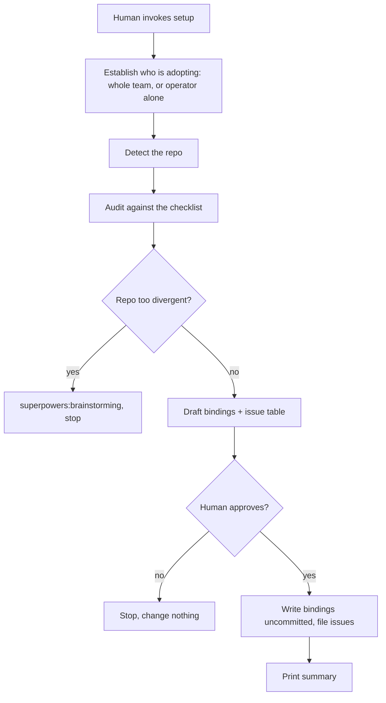

# Setting up a repo

This runs once per repo, right after the plugin is installed, against
the repo the session is already in. A human starts the
`setup` skill. It never starts itself, and no other process invokes it.

The repo is frequently not ours — a client's, or another team's — and
the human running setup is a guest in it, holding one contractor's
access. Step 0 establishes which case this is, because it changes what
setup is willing to file.

The output is three things: a `### Dev flow bindings` section written
into the repo's `CLAUDE.md`, one issue filed per remaining gap, and a
summary of what it could not determine. Nothing is written and nothing
is filed before the human has seen what setup proposes — the drafted
bindings, and the issues or the backlog that go with them — and
approved it.



## Write for the operator

The person running setup is, by definition, the one who has not adopted
these processes yet. This run may be the first contact they have with any
of it, and every word this page uses for its own machinery — *binding*,
*entry*, *probe*, *candidate*, `unknown` as a state — is vocabulary from
inside the process rather than from the repo they are looking at.

So **every term of art in a line setup prints or a question setup asks
carries a short gloss at first use in the session**, in the line itself
where the operator reads it, not in a note to the agent. Name the thing
in the repo's own terms and the internal word second, or drop the
internal word entirely where the plain phrase carries the meaning. A
checklist entry's id is printed with what it is, never on its own.

This is the peer of the three rules below that already govern everything
setup *writes*: the `CLAUDE.md` section opens with a sentence for a
reader who arrives cold (step 4), `intent` strings have to survive a
reader who has never seen this process (step 5), and a filed issue may
not justify itself by naming this SDLC (step 5). The live session was the
one audience with no rule, and it is the audience least likely to know
the words.

Explaining costs prompt length, not steps. **Every question setup asks
states a default that enter accepts**, so an operator who knows the
vocabulary clicks through the run exactly as fast as before, and one who
does not reads a sentence instead of guessing. The glosses lengthen
prompts; they never add a question, a required answer, or a stop.

## 0. Establish who is adopting this

Ask one question, before reading anything:

```
Who is adopting this flow in this repo?

  team — this repo's whole team works through it; changes to the repo's
         own tooling are theirs to make and theirs to run.
  solo — only I have this tooling; the repo belongs to someone else, and
         I am a guest in it.

The answer decides what setup is allowed to file in this repo's tracker.
On team, every gap setup can file becomes an issue here. On solo, the gaps
that would commit this repo's owner to paying for an AI credential, or to
giving an agent write access here, are listed for you to raise with them
instead of filed on their behalf; everything else about the run is
identical.

(team / solo — enter accepts solo, which files less)
```

Ask it. Do not infer it from the remote's owner, from whether the human
has push access, or from anything else — a contractor with full write
access to a client repo is still a guest, and an employee working in a
fork of their own team's repo is not. If the human does not answer, take
`solo`: it files strictly less, and the cheaper mistake is a gap the
human has to file by hand rather than an unwanted issue in someone
else's tracker.

This changes exactly one thing downstream: **which entries step 5 is
allowed to put in the issue table.** Detection, the audit, the escalation
check, and the bindings the run composes behave identically either way,
and the summary still accounts for every entry — a held-back one moves
from `Filed` to `Reported, not filed`, and none falls out.

- On `team`, every eligible entry reaches the table — the rule in step 5
  is the whole rule.
- On `solo`, an entry reaches it only if it is guest-filable. The rest
  are held back and reported in step 6 instead, under `Reported, not
  filed`, so the human can raise them with whoever owns the repo rather
  than filing on their behalf.

**Read that off the entry, not off a list here.** Each checklist entry
carries `guest_filable`, and an entry that omits it is guest-filable —
the common case, so only the exclusions are written down. Step 5 applies
the key; this step explains what sets it.

The test an entry's author answers when they set it: does the repo get
the benefit through the host's own UI or CI, for contributors who run no
agent at all — and does it land without the repo's owner provisioning a
model-provider credential or granting an agent write scope? Both halves
have to hold. An entry that fails either is `guest_filable: false`.

The key lives in the entry's `requires:` block rather than in a table on
this page because `checklist.json` grows, and a table here would not.
An entry added later carries its own answer; nothing has to remember to
come back and add a row.

How today's entries fall out, as an illustration of the test rather than
as the rule:

| Entry | Filed on `solo`? | Why |
|---|---|---|
| `issue-template` | yes | A template renders in the host's own new-issue form. Every human who files an issue there gets it, whether or not they run any agent. |
| `area-labels` | yes | Labels are read in the host's UI by anyone filtering the backlog. The taxonomy is the repo's own to name; nothing about it depends on the tooling. |
| `verification-workflow` | yes | CI running the repo's own build, lint and test commands on every pull request pays for itself for the whole team, and needs no credential beyond what the host already provides. |
| `automated-review-workflow` | **no** | It runs on a model-provider credential the repo's owner has to provision and pay for, on a recurring basis. Proposing that is the owner's call, not a guest's. |
| `intake-workflow` | **no** | Same: a paid, credentialed agent, granted write scope over the repo's issues. A guest does not file for that scope in someone else's tracker. |
| `dev-flow-bindings` | n/a | Carries `writes:` — never filed on either path. Step 4 composes it and the gate releases it, uncommitted. |
| `project-board` | n/a | Carries `optional:` — never filed on either path. |
| `docs-drift-workflow` | n/a | Carries `optional:` — never filed on either path. |

The three `n/a` rows never produce an issue at all, so there is no guest
case to decide and they carry no `guest_filable` — declaring one is
rejected at build time rather than sitting there reading as meaningful.

## 1. Detect

Read the repo's own configuration for each value the bindings need.

| Value | Source |
|---|---|
| Code host | `git remote -v` |
| Issue tracker | the host, plus the shape of ticket references in history. Scan the last ~300 commit subjects and ~100 merged pull-request titles for `[A-Z][A-Z0-9]*-\d+`. A prefix is proposed as a Jira project key only when it appears in **at least five** of them *and* is the most frequent prefix found — `sort \| uniq -c \| sort -rn` over what is already being read. Five, not three: a lone noisy prefix with no real competitor — three stray `PR-N` pull-request references and nothing else, say — clears "most frequent" trivially since nothing else is there to lose to, so the floor alone has to carry the weight of ruling it out. Below that threshold **with no Jira-shaped reference at all**, the repo is GitHub-tracked outright — the ordinary case, and nothing asks about it. Below the threshold **but with at least one Jira-shaped reference**, the evidence is ambiguous rather than absent: propose nothing, and let the gate ask directly rather than default silently (see the Jira-evidence question below). Never filter with a stoplist: that regex also matches `UTF-8`, `ISO-8601`, `SHA-256`, `RFC-2119`, `PR-42` and `GH-123`, and a stoplist of technical prefixes never finishes — every entry it lacks is a silent failure at one specific client. Dominance removes the same noise for the right reason: a real Jira project appears across a large share of subjects, `SHA-256` appears once. A proposed key is never written on its own — it goes to the gate with the site question below. On a rerun, an existing `Issue tracker` row already naming Jira is carried over as-is, the same way `Board` and `Specs and plans` are below — the regex re-derives a value only when there is no existing row to carry, never to override a human-set one whose evidence has since fallen below the threshold. |
| Default branch | `git symbolic-ref refs/remotes/origin/HEAD` |
| Branching model | the base branch of the last ~30 merged pull requests (`gh pr list --state merged --limit 30 --json baseRefName`), read as where feature work lands. A clear majority onto the default branch is GitHub flow; a clear majority onto some other branch names that branch as the one feature work integrates through, whatever the repo calls the model. Branch names on the remote are **not** evidence: an `origin/develop` that exists is not proof that anything merges into it, and it is as likely to be a branch someone left behind — filling this row from a branch listing is exactly the guess the paragraph below forbids. No merged pull requests, no clear majority, or a host this cannot be queried on leaves the row `unknown`. |
| CI provider | `.github/workflows/`, `bitbucket-pipelines.yml`, `.gitlab-ci.yml` |
| Stack | the same manifests the row below opens, read for what the repo *is* rather than what it runs: `package.json` (plus its lockfile, `engines`, and framework dependencies), `pyproject.toml` or `requirements.txt`, `go.mod`, `Cargo.toml`, `composer.json`, `Gemfile`, `pom.xml` or `build.gradle`, plus `Dockerfile` and any pinned-version file (`.nvmrc`, `.python-version`, `.tool-versions`). Record the language and its runtime version, the package manager, and the dominant framework, in the repo's own names for them. A polyglot repo gets each part named rather than one of them picked. |
| Verification commands | `package.json` scripts, `Makefile` targets, `pyproject.toml`, `composer.json` |
| Automated reviewer | The GitHub Actions repository variable `AUTOMATED_REVIEWER`, after a confirmed automated-review workflow. It must be exactly `claude` or `codex`; an empty or unsupported value is a configuration failure, not an `unknown` binding. Also confirm no second independently triggered automated-review workflow remains active, because two active reviewers are the same misconfiguration. |
| Commit convention | the Conventional-Commits prefix rate across the last ~50 subject lines |
| Specs and plans | an existing `### Dev flow bindings` section's own value, and nothing else. If the repo has no such section, the row is `unknown`. Do not fill it from `docs/superpowers/specs/` or `docs/superpowers/plans/` existing on disk: a directory being there says nothing about whether the repo ignores it, and a row naming a path the repo tracks turns working notes into committed repo content the next time an agent writes a spec. The paths and the ignore rule that goes with them are a human's call. |
| Board | human-supplied. The checklist's `board` probe (step 2) only establishes that the owner has at least one project — it ties none of them to this repo and learns no field IDs. Carry over an existing `### Dev flow bindings` section's value if the repo has one; otherwise the row is `unknown` until a human names the board, however many the probe returned. Under a Jira tracker this row is expected to be absent, and that is not a gap: `Board` is a GitHub Projects row, and Jira status transitions carry the card instead. |
| Task orchestrator | an existing `### Dev flow bindings` section's value, carried over verbatim, and nothing else. With no such row it is `unknown` and the gate asks. **Nothing on this machine is evidence for this row** — see below. `unknown` is not a failure: it means this repo works its issues in live sessions, which is the ordinary case. See [`./task-dispatch.md`](./task-dispatch.md). |

**The orchestrator row is the one value with a second, separate fact behind
it, and the two must not contaminate each other.**

- **The row is the repo's decision.** It is written into the bindings file,
  which is committed and read by everyone.
- **Whether this machine is configured** is a different fact with a different
  answer per developer, because the orchestrator's configuration is git-ignored
  and never travels with a clone.

**Machine state is never evidence for the row.** An orchestrator binary on this
`PATH`, or an orchestrator directory someone created in this checkout, says
what one developer happened to install — not what the repo decided. Treating it
as a hint would let one person's `npx` experiment be committed as a repo-wide
binding that nobody agreed to, in a file everyone reads. With no row, the answer
comes from the human at the gate, and from nowhere else.

The detection runs one way only: the row is read from the bindings or asked
for; the machine is probed in **step 6**, which is the only step that can act on
what it finds, and which writes nothing shared.

That separation is what makes the second developer work. The first names Cezar,
is configured, and commits the bindings. The second clones, runs setup, and
finds the row already resolved — so nothing is asked, and if the row were the
only fact consulted, nothing would be done either. They would be told the repo
uses an orchestrator while their machine had no idea how to reach one.

Anything that cannot be detected is recorded as `unknown` and reported
at the gate on the `Could not determine` line. It is never invented: a
guessed default branch or a guessed verification command is worse than
an absent one, because `dev-flow` will act on it. Step 4 says what an
unresolved value looks like in the written table.

Four rows get more than a report when they come back `unknown`, because a
human can answer them in one line and nothing else can: `Board`, which is
human-supplied by definition; `Stack`, when no manifest in the list was
recognisable; `Branching model`, when the repo's merge history was
empty, split, or unreadable; and `Task orchestrator`, which no probe can
settle because whether a team wants to hand work off is a decision, not a
fact about the repo. The gate asks for each of them directly — see
"Rows the gate asks about" in step 5. An unanswered question stays
`unknown`; it is not a reason to stop.

Further questions fire whenever the **effective** `Issue tracker` binding
is Jira — freshly proposed this run, ambiguous (some evidence, below the
dominance threshold), or carried over from an existing row that still has
a value missing — not only on a fresh, confident detection. A carried-over
row is not a re-detection: it skips the regex entirely, so nothing about
it re-triggers these questions on its own, and a rerun that never asks
them never resolves the missing values either.

Ambiguous evidence gets one question of its own first — is this repo
Jira-tracked at all — since a repo below the dominance threshold might
still not be a Jira repo, and asking the other two would presume an answer
nobody gave. A confident detection or a carried-over row skips straight to
the other two: the site URL, and the status names for `Tracker statuses`,
neither of which exists anywhere in the repo to read. All three are asked
in the same block, on the same terms — an answer fills the row, no answer
leaves it `unknown`, and a "no" to the evidence question leaves `Issue
tracker` as GitHub-tracked and skips the other two. The site becomes part
of the `Issue tracker` row's value (`Jira, project key <KEY>, site
<site>`); the status names fill the separate `Tracker statuses` row.

`Stack` is not decoration. It is what every filed issue is written in
terms of in step 5, and what a CI workflow gets generated from later — a
workflow is composed for the stack the repo declares, never pasted from a
template, so a run that never learned the stack hands the next agent
nothing to compose against.

## 2. Audit

Read the bundled `docs/checklist.json` — the manifest of repo artifacts
these processes depend on, collected from every process doc's
`requires:` block. Run each entry's `detect` probe against the target
repo and record one of `present`, `candidate`, `missing`, or `unknown`.

| `detect.kind` | Probe |
|---|---|
| `path` | Glob for the pattern |
| `matches` | Grep `detect.in` for the regex |
| `labels` | `gh label list`, then compare against `detect` — see below |
| `heading` | Read `detect.in` and look for the heading |
| `board` | `gh project list` for the owner |

A `labels` probe reads `detect.min_count` first.

**With `min_count: N`** — the question is whether the repo has an area
taxonomy of its own, not whether it has ours. It is `present` when the
repo has at least N labels that classify issues by area of work, and
`missing` otherwise. `detect.labels` is then the declaring repo's own
set: an example of what a taxonomy looks like, never the bar the target
repo is measured against. A repo with `backend` / `frontend` / `infra`
passes on its own vocabulary and no issue is filed.

Judge that on the labels the repo added, not on the ones GitHub creates
with every repository — `bug`, `documentation`, `duplicate`,
`enhancement`, `good first issue`, `help wanted`, `invalid`, `question`,
`wontfix`. Those are a workflow taxonomy (what kind of thing is this),
not an area one (what part of the system does it touch), and counting
them would pass every repo that has never labelled anything. `duplicate`
in particular is created by `issue-intake`'s own dedup path, so it can be
present in a repo with no taxonomy at all.

**Without `min_count`** — strict: `present` only when every label in
`detect.labels` exists, and a partial match is `missing`.

When a `min_count` probe comes back `missing`, the filed issue proposes
a taxonomy drawn from the target repo's own structure — its top-level
directories, its stack, the areas its existing issues already talk about
— and offers `detect.labels` at most as an illustration of the shape.
Never write our label names into the issue as the set to adopt. The
whole point of the threshold is that the repo names its own areas; an
issue that ships our seven has taken that back.

`unknown` is its own state, not a synonym for `missing`. A `labels`
probe in a repo where `gh` is unauthenticated is `unknown` — the probe
did not run, so nothing was learned. Recording it as `missing` would
file a bogus issue asking for labels the repo may already have.

Two flags on an entry change what happens later, not what the probe
does:

- `writes: true` — a gap here is fixed in place by step 4 rather than
  filed as an issue.
- `optional: true` — its absence is reported in the summary, under step
  6's `Reported, not filed` group, and never filed.

### Entries that cannot auto-pass

An entry carrying `confirm: true` never resolves to `present` on a
probe hit alone. A hit resolves to `candidate`, and the human decides
at the gate.

`confirm:` softens a hit and nothing else. On a miss the entry is
`missing` outright, exactly as an unflagged one would be — there is no
file to name, so there is no question to ask — and it goes to step 5
like any other gap.

The reason a hit is not enough is that a `matches` probe greps the whole
workflow file, not just its `on:` trigger — a hit anywhere in the text counts, whether
it's in the trigger, a `permissions:` block, a job name, or a comment.
A `pull_request` workflow that only lints satisfies
`verification-workflow`'s regex and would hide the exact gap this audit
exists to find. A workflow that merely declares `issues: read` under
`permissions:`, with no `issues:` trigger at all, satisfies
`intake-workflow`'s regex the same way. Over-reach is not only about
triggers: `automated-review-workflow`'s regex names review tools, so it
matches every workflow built on one — a triage job and a docs judge
running the same action match as readily as the code reviewer does.
That file-wide reach is not a tolerable rough edge — it is exactly why
these entries carry `confirm: true` instead of auto-passing on a hit.
The regex is the best
cheap probe available; it is not evidence of intent.

The asymmetry is what justifies asking an extra question. A false
`present` silently hides a gap and nobody finds out until the process
that depended on it misbehaves. A false `missing` only adds a row to
the issue table that the human drops in one word.

Resolution:

- a `candidate` the human confirms becomes `present` — no issue filed;
- a `candidate` the human rejects becomes `missing` — filed like any
  other gap;
- setup names the file that matched and asks one question per
  candidate, never a single blanket question covering several.

The prompt says what a candidate is, and what each answer causes, because
neither is inferable from the word or from the file name:

```
Two files here are candidates: setup found text in them that looks right,
and text alone cannot tell whether the file does the job — so it asks you
rather than crediting them itself. y counts the file as already doing the
job, and nothing further is reported about it. n treats the job as still
missing: it becomes a row in the issue list below, which you can still
drop there — or, for the jobs this run is not filing in a repo that is not
yours, a line in the summary for you to raise with whoever owns the repo.

  verification-workflow — CI running this repo's own checks on every
  pull request
  ci.yml mentions "on: pull_request". Does it actually run this repo's
  build, lint and test commands? (y / n — enter accepts n, which keeps
  this on the list of gaps)

  intake-workflow — labelling and duplicate-checking newly opened issues
  stale.yml mentions "on: issues". Is that triaging new issues? (y / n —
  enter accepts n)
```

The shared opening is printed once; each candidate still gets its own
question, and the answer to one never carries to another. The default is
`n` for the reason the asymmetry above gives: an unanswered candidate
stays on a list the operator can still act on — a row they drop in one
word where this run is filing, a line they raise with the repo's owner
where it is not — never a gap that quietly disappears.

A `candidate` counts as neither present nor missing for the escalation
threshold in step 3. Only `unknown` feeds that count.

Which entries carry `confirm:`, `writes:`, or `optional:` is recorded
in `checklist.json`, not here — read the flags off the entry rather
than from memory.

### Required plugins are session state, not a repo gap

`checklist.json` holds repo artifacts. The plugins these processes need are
a property of the session running them, so they are not in it and never
become an entry. They are listed in
[`./prerequisites.md`](./prerequisites.md) instead.

Check that list here, while the audit is already reporting on what is and
isn't in place, and report a missing plugin in step 6 as its own line —
outside the seven groups, which account for entries and bindings rows.

**Never file an issue for it.** A missing plugin is not fixed in the target
repo by anyone who reads its issue tracker; it is fixed by whoever runs the
session, by installing it — see [`./prerequisites.md`](./prerequisites.md) for
the install path in each harness. An issue asking a repo to install a
plugin would sit open forever, because the repo was never the thing that
was wrong.

Reporting it here is what makes step 3's stop predictable. That step hands
off to `superpowers:brainstorming` on escalation and stops anyway when the
skill is unavailable — an outcome the operator should have already been
told about at the audit, rather than discovering it at the moment the run
needed the skill.

A missing plugin is not itself an escalation trigger, and does not stop
setup. Setup audits a repo and writes bindings; none of that needs
`superpowers`. `dev-flow` is where the same absence is a hard stop, because
that is the process built on the skills — see
[`./dev-flow.md`](./dev-flow.md) step 2.

## 3. Escalate, or continue

Hand off to `superpowers:brainstorming` and stop when either of these
holds. Name the condition that tripped before handing off, so the
escalation is reproducible rather than a judgement call.

- **No git remote at all.** There is no host, tracker, or board to
  bind, so there is nothing to record.
- **More than half the non-optional entries came back `unknown`.** The
  audit did not learn enough about the repo for its output to be worth
  acting on.

If `superpowers:brainstorming` is not available in the session, stop
anyway — the escalation is the stop, not the skill. Tell the human which
of the two conditions tripped, hand them what the run did learn — the
values step 1 resolved, and what it found or failed to find for each thing
the checklist looks for, each named as what it is — and say that the rest
is a conversation rather than an audit. Do not fall through to step 4: an
escalation that quietly continues because a skill was missing is the one
outcome this step exists to prevent.

A repo with no CI provider and no recognisable verification commands is
**not** an escalation trigger. That is a greenfield repo — precisely
the case this process exists to serve. Record both rows as `unknown`
and let step 5 file the gap; the checklist's `verification-workflow`
entry exists to turn exactly that gap into an issue.

A non-GitHub host or tracker is **not** an escalation trigger either. That is
the recorded-deviation path: setup still writes the bindings with the
Jira project key or Bitbucket workspace in them, still prints the
backlog, and files nothing. Escalating there would throw away a
perfectly good result.

## 4. Write the bindings

Compose the section here; do not write the file yet. This step decides
the target file and every row's value, and the human gate in step 5 is
what releases it to disk. An agent that writes at the end of this step
has skipped the gate.

The target is `CLAUDE.md`, created if it is absent — or `AGENTS.md` if
the repo has that file and no `CLAUDE.md`.

If a `### Dev flow bindings` section already exists, update it in
place: rows the audit resolved get the new values, and rows it could
not resolve are left exactly as they were rather than overwritten with
`unknown`. Downgrading a human-written value to `unknown` is a
regression, not an update.

**A reserved row the existing section does not have is added, not skipped.**
The reserved set above grows over time, so a table written by an earlier
version is missing every row added since — and a re-run that only touched
rows already present would leave those repos permanently a version behind.
An added row is filled like any other: from the audit, or `unknown` if the
audit could not resolve it and the human did not answer at the gate. This is
the migration path for a repo bound before a row existed, and it is why
re-running setup after upgrading the plugin is worth doing even when nothing
about the repo changed.

In a section written fresh there is no previous value to keep, so a row
the audit could not resolve is written with the literal value `unknown`
— never omitted, and never filled with a plausible guess. The row label
is what a consumer looks for, so an absent row reads as
"this repo does not need one" while `unknown` reads as the open
question it is.

Deviations get their own rows — `Issue tracker | Jira, project key ABC,
site abc.atlassian.net` — rather than being left absent, so the next
reader sees the deviation instead of inferring it from a hole.

A section written fresh opens with one neutral sentence, so a reader who
arrives cold can tell what the table is for and what keeps it current.
Every value below is a placeholder — fill each one from step 1, and copy
none of them:

```markdown
### Dev flow bindings

Concrete values for this repo, in one place so every contributor — human
or agent — reads the same ones. Rows are matched by label, so update a
row's value when the thing it names changes, rather than its label.

| Binding | Value |
|---|---|
| Default branch | `<default branch>` |
| Branching model | <model> — feature branches off `<branch>`, pull requests based on `<branch>` |
| Code host | <host> |
| CI provider | <ci provider> |
| Issue tracker | <tracker> |
| Tracker statuses | <stage> → `<status>`, <stage> → `<status>` |
| Stack | <language and runtime version>, <package manager>, <framework> |
| Verification | `<command>`, `<command>` |
| Automated reviewer | `AUTOMATED_REVIEWER=<claude or codex>` |
| Commit convention | <convention> |
| Specs and plans | `<specs path>`, `<plans path>` |
| Board | **<board name>**, <owner kind> `<owner>`, project #<number> |
| Task orchestrator | <orchestrator> — `<dispatch command>`, workflows in `<workflow dir>` |
```

The example is placeholders on purpose. `Board` in particular is the row
most likely to be transcribed rather than probed — it is the one value no
probe can supply — and a board name carried over from an example is a
binding that points at somebody else's project.

The heading and all thirteen row labels above are reserved. A consumer of
these bindings matches on the label verbatim, so do not reword them — a
consumer looking for `Default branch` and finding `Main branch` reads
it as absent, which is the failure mode this section exists to remove.
That is a contract going forward, not a claim about what reads each
label today: `Code host`, `Issue tracker`, `CI provider`, and `Stack`
carry step 1's detection through to the written record, so the two
sections agree on what setup detects and what it writes, and so a later
consumer has a label to match. A repo may add rows of its own; renaming
or dropping one of these is what breaks. Values are the repo's own;
labels are fixed.

### `Tracker statuses` names this workflow's stages in the project's words

`dev-flow` moves a ticket twice: once when work starts and once when it
goes up for review. Under a GitHub tracker those are board column IDs,
recorded in `Board`. Under Jira they are status names, and a status name
is the project's own string — `In Progress`, `Code Review`, `Selected for
Development`, whatever the workflow was built with.

    | Tracker statuses | In progress → `In Progress`, In review → `Code Review` |

The left side of each arrow is this workflow's stage, and it is fixed —
`In progress` and `In review`, the same two stages steps 4 and 9 move
through. The right side is the project's status, backticked because it
has to match Jira character for character.

**`none` is an answer.** A workflow that goes In Progress straight to
Done, with review living in the pull request, records `In review →
none`. That is a correct project, not a gap, and the stage is skipped
without comment. `none` is not `unknown`: `none` says this workflow has
no such stage, `unknown` says nobody has said yet.

**An absent row splits by tracker.** Under a GitHub tracker nothing reads
it, so an absent row changes nothing — which is what every repo bound
before this row existed needs. Under a Jira tracker an absent row is a
**stop**.

That stop is a deliberate exception to the growth rule in
[`./dev-flow.md`](./dev-flow.md), and it is the only row that gets one, so
do not copy it as a pattern. The rule says a new row falls back to
whatever the flow did before the row existed. Under Jira the flow did
nothing before this row existed — there is no predecessor behaviour to
fall back to, so there is nothing to fall back *to*. A row with a
predecessor never earns this.

### `Default branch` and `Branching model` answer different questions

Two branch-shaped rows now sit next to each other, so say what separates
them rather than leaving a reader to reconcile them:

- **`Default branch`** is what the host serves — what a fresh clone checks
  out, and what a pull request targets when nothing says otherwise.
- **`Branching model`** is where feature work starts and where it lands.

Under GitHub flow those are the same branch, and the two rows name it twice:

```markdown
| Default branch | `main` |
| Branching model | GitHub flow — feature branches off `main`, pull requests based on `main` |
```

Under git flow they differ. The default branch is what releases ship from,
and features integrate through `develop`:

```markdown
| Default branch | `main` |
| Branching model | git flow — feature branches off `develop`, pull requests based on `develop`; releases and hotfixes off `main` |
```

So a difference between the two rows is the deviation this row exists to
record, not a contradiction to resolve. They cannot disagree, because
neither answers the other's question.

Only one part of the value is read by a consumer: **the branch feature work
starts from and lands on**. The model's name orients a human, and a repo
may record more of its model in the row — git flow's release and hotfix
branches, as above — with nothing acting on it. That is why the row names a
branch rather than holding a bare model name. A repo running a model nobody
has written down still has one concrete fact to record, where a bare name
would oblige every consumer to keep a table of models and to guess at any
name missing from it.

## 5. File one issue per gap

An entry is eligible for an issue when it is `missing`, and not
`writes:`, and not `optional:`, and — on the `solo` answer to step 0 —
not `guest_filable: false`. Everything else is reported in the summary
instead.

All four are read off the entry in `checklist.json`, so an entry added
later is decided by what it declares rather than by anything written on
this page.

Bodies follow [`./issue-authoring.md`](./issue-authoring.md) — the same
template, the same shipped-outcome acceptance criteria. Labels are
`repo-setup` plus the entry's `area`. The first line of every body is
the dedup marker, carrying the entry's id and its `source`:

```
<!-- repo-setup:<id> source:<source> -->
```

The id is what re-runs dedup on. The `source` rides along so a later
`dev-flow` run can recover which process doc this issue is an instance
of, without putting an internal filename on screen in a repo where it
resolves to nothing. Rendered markdown hides the whole line.

Before drawing up the table, list what is already there and skip every
id already marked in one of the returned bodies. Match on
`repo-setup:<id>` alone, not on the whole marker: the `source` that
follows it is part of the trace, not part of the key, and an issue filed
before it was added carries a marker without one. Matching the whole
line would file every one of those a second time. This read is safe to
run now — it reads, it does not write:

```bash
gh issue list --label repo-setup --state open --json number,body
```

A repo that has never been set up has no such label; an error or an
empty result there means "nothing filed yet", not a failure. The label
itself is not created here — it is created after the gate, in the
sequence below.

### What the issue says

A title alone is not a task. The entry already carries what the artifact
has to achieve (`intent`) and, for the four workflow entries, the access
it needs to achieve it (`grants`); the run already knows the repo's
`Stack`. All three go into the body, so whoever picks the issue up can
start without reconstructing any of it.

Render `intent` and each `grants` string **verbatim**, as they appear in
`checklist.json`. They are written to be readable by someone who has
never seen this process; paraphrasing them loses that and makes two runs
of setup produce two different issues from the same entry.

The body is exactly this, in this order:

```markdown
<!-- repo-setup:<id> source:<source> -->

## Context / Why
<up to 80 words, per the budget table in `issue-authoring.md`: what the
repo does today without this artifact and what that costs, in the repo's
own terms — its Stack, its host, its CI provider, its default branch,
taken from the bindings step 4 composed.>

## What needs to be done
<the entry's `intent`, verbatim, as the outcome to achieve>

Concretely, for this repo: <how that outcome lands given the Stack — the
commands this repo actually runs, the manifest the workflow installs
from, the runtime version it pins.>

### Access it needs
- <each `grants` string, verbatim, one bullet each, in checklist order>

## Acceptance Criteria
- [ ] <shipped, verifiable outcome>
- [ ] <shipped, verifiable outcome>
```

Rules that make two runs produce the same shape:

- **`### Access it needs` appears only when the entry has a `grants`
  key.** Four of the eight entries have none — the field is absent, not
  empty. Omit the heading entirely for those; never emit it with "none",
  "n/a", or an empty list.
- **The `Concretely, for this repo` line is where `Stack` earns its
  row.** Write the workflow, template or label set for the stack the
  repo declared. Never paste a workflow from somewhere else and never
  write one for a stack the repo does not use. If `Stack` is `unknown`,
  say so in the issue and ask for it there rather than picking one.
- **`## Out of scope` is omitted** unless the entry's boundary against
  another entry in the same batch is genuinely unobvious.
- **Nothing visible names the entry's `source`.** It travels in the
  first-line marker and nowhere else.

For `automated-review-workflow` specifically, the issue has to name a
starting point or it is unactionable. Require the repository variable
`AUTOMATED_REVIEWER` alongside that workflow: it selects exactly one of
`claude` or `codex`. A missing or unsupported selector, or a second active
review workflow, is a configuration failure to fix with the review setup —
never a reason to run both providers or silently skip review. Recommend the
review capability the selected agent vendor already bundles, and treat a
repo-authored review skill as the later option; the reasoning, cost tradeoff,
credential isolation, and provider-specific wiring live in
[`./pr-checks.md`](./pr-checks.md) under "Automated review". Read the
recommendation off that section rather than restating it here or arguing the
tradeoff out in the issue body.

For `intake-workflow`, require `ISSUE_INTAKE_PROVIDER` set to `claude` or
`codex`, plus the matching secret (`ANTHROPIC_API_KEY` or
`OPENAI_API_KEY`). For `docs-drift-workflow`, require
`SDLC_DOCS_PROVIDER` the same way. A missing or unsupported selector is
a configuration failure, not a reason to skip the check or fall back.
Claude is the default-compatible path: current permissions and
headless behaviour stay as they are when that value is selected. The
variables, secrets, and provider-specific wiring live in
[`./issue-intake.md`](./issue-intake.md) and
[`./sdlc-docs-check.md`](./sdlc-docs-check.md).

### Resolving candidates

Ask one question per `candidate`, naming the file that matched, before
drawing up the issue table. A confirmed candidate drops out of the
table; a rejected one joins it. The table the human approves is the
table after this pass, so candidates are never presented as gaps and
resolved afterwards.

Ask about a candidate step 0 held back too. It will not reach the table
either way, but the answer is what decides whether step 6 reports it as
`Present` or as a gap the human still has to raise with the repo's
owner — and the question costs one line and reads nothing.

### The human gate

Nothing is written to the repo — no file, no label — and nothing is
filed until the human has seen the drafted bindings table and the issue
table and approved them. Everything up to this point reads.

#### Rows the gate asks about

Print the bindings first. If `Board`, `Stack`, `Branching model` or `Task
orchestrator` came back `unknown` from step 1, ask for each one directly,
one line each, before the approve prompt:

```
Board: no project board is tied to this repo. Working an issue through
this flow moves its card across that board as work starts and goes up for
review, so a board named here is a step that happens on its own, and one
left unknown is a step that is skipped. Name the board, its owner and its
number, or press enter to leave it unknown.
Stack: no manifest here was recognisable, so setup does not know what this
repo is built with. Every issue it files is written in those terms — the
commands your CI would run, the manifest it installs from, the runtime it
pins — so left unknown, those issues have to ask you for the stack
instead of proposing something concrete. Name the language, runtime
version, package manager and framework, or press enter to leave it
unknown.
Branching model: setup could not tell where feature work starts in this
repo — nothing here has been merged yet, or what has went to more than one
branch. Every branch this flow cuts starts from the branch you name here,
and every pull request it opens is based on it, so left unknown the flow
has no start point and stops instead of picking one. Name the model and the
branch feature work starts from and lands on — "GitHub flow, off main" is a
complete answer — or press enter to leave it unknown.
Task orchestrator: do you want to hand issues off to run unattended? A dispatched
issue is taken to a draft PR without holding your session open, on your own
subscription, on this machine or a server you own. `cezar` is the orchestrator
this SDLC supports; `none` leaves every issue worked in a live session, as now.
(cezar / none — enter accepts none)
Jira evidence: commit history here has a few keys shaped like GA-12, not
enough of them to confidently call this repo Jira-tracked over GitHub. Is
this repo actually tracked in Jira? Answering yes asks the two questions
below; answering no leaves Issue tracker as GitHub-tracked and skips them.
(yes / no — enter accepts no)
Jira site: this repo's Issue tracker is Jira — commit history says so
confidently, an existing binding already does, or the answer above just
confirmed it — but no site is recorded yet. Every Jira call this flow
makes is scoped to one site, and a call scoped to the wrong one reads or
moves a ticket in another company's Jira. Name the site —
apptension.atlassian.net, or your own custom domain if the Cloud instance
has one — or press enter to leave it unknown.
Tracker statuses: Jira status names are the project's own, so this flow
cannot guess them. Name the status this workflow puts started work into,
and the one it puts work up for review into — "In Progress and Code
Review" is a complete answer. If review lives in the pull request and
there is no review status, say none for the second one. Press enter to
leave the row unknown.
```

**`setup` never calls the Atlassian MCP.** It runs against a repo with no
guarantee a connector is attached, and reading statuses from
`getTransitionsForJiraIssue` would be worse than asking anyway: that call
returns the exits from *one ticket's current status*, so a ticket sitting
in a testing status shows the statuses either side of it and never the
review status three steps back. A proposal built from that list would be
confident and incomplete. The human answers in one line; the connector
gets exercised by `dev-flow`, which needs it regardless.

An answer replaces the row's value in the table that is about to be
printed. No answer leaves the row `unknown` and it is reported on the
`Could not determine` line like any other. None of the questions above is
a reason for **setup** to stop, and none is asked for a row step 1
already resolved with confidence.

What the `Branching model` question warns about is a later stop
in `dev-flow`, which is a different process and stops for its own reasons
— see [`./dev-flow.md`](./dev-flow.md) step 3.

##### Why the orchestrator question is a closed choice

`Task orchestrator` is the one of the four that asks about a **preference**
rather than a fact the repo already contains. The other three ask because
a probe failed and a human knows the answer, and their answers are
unbounded — a board name, a stack, a branch — so they have to be typed.
This one asks because there is nothing to probe: a team that has never
dispatched a task leaves no trace of it in the repo.

That makes it the one question with a short, known answer set, so it
**offers the options instead of asking for a name.** Asking someone to
type an orchestrator when exactly one is supported invites a value the
process cannot act on, and costs a round trip to reach the answer the
question already knew. A name outside the set is still accepted and
recorded verbatim — the row is deliberately not Cezar-specific — but
`task-dispatch` will stop on it until a process supports it, and the gate
says so rather than letting it look configured.

##### `none` is an answer, and `unknown` is not

Answering `none` writes `none`, not `unknown`. They behave identically —
neither dispatches anything — but they say different things, and setup is
re-runnable. `unknown` means nobody has decided, so the question comes
back on the next run, which is right for the other three rows. `none`
means the team decided, and re-asking a settled question every time setup
runs is how a prompt becomes noise people click through.

So this row has a fourth state, and it is the only row that needs one:
the other three cannot be answered "we don't want one".

#### The approve prompt

Then — with `CLAUDE.md` below standing for whichever file step 4 chose as
the target, so a repo whose bindings go to `AGENTS.md` sees `AGENTS.md`
named here and in every line further down that names one. The point of
naming the file at all is that the operator can go and look at it, which a
wrong name defeats more thoroughly than "the bindings" did.

```
Issues to file (4) — nothing is written or filed until you confirm

| # | Title                                                    | Labels                   |
|---|----------------------------------------------------------|--------------------------|
| 1 | [Task]: Add an issue template with acceptance criteria   | repo-setup, issue-intake |
| 2 | [Task]: Label issues by area of work                     | repo-setup, issue-intake |
| 3 | [Task]: Triage newly opened issues automatically         | repo-setup, issue-intake |
| 4 | [Task]: Run the verification suite on every pull request | repo-setup, ci           |

Already filed, skipping: automated-review-workflow — an automated code
  review on every pull request, already open as #31
Could not determine: board — not answered above, so no card gets moved
  until a row names one

Three things happen if you confirm.

This repo's CLAUDE.md gains a "### Dev flow bindings" section: a short
table of this repo's own values — default branch, the commands that verify
a change, the tracker, the board — that these processes read instead of
guessing at them. It goes into your working tree and is left uncommitted,
for you to land through this repo's normal flow.

The 4 issues above are filed in this repo's tracker.

And this repo's task orchestrator, Cezar, is configured on this machine:
.ai/cezar/ is written from those bindings, its base branch taken from the
branching model above and its verification check from the verification
commands above. That directory is git-ignored, so it does not arrive with
a clone. Both files are shown before they are written.

Write the CLAUDE.md table, file these 4, and configure Cezar? (yes /
drop some / edit a title / no — enter accepts yes)

  drop some, edit a title — revise the issue list above. Neither touches
  the CLAUDE.md table, which is written exactly as printed, or not at all.
```

The third effect appears when the `Task orchestrator` row names an
orchestrator **and this machine is not already configured for it** — which
covers both the developer who just answered the question and every
developer who clones afterwards and finds the row already there. A row
reading `none`, `unknown`, or absent leaves the prompt at its two original
effects and its original wording, and so does a machine already configured
and in step with the bindings.

The sentence deliberately does not say *because you named Cezar*. Most of
the people who see it will not have named anything; they will have cloned
a repo where someone else did.

Every row carries `repo-setup` alongside its area label, because that
is the label dedup and every re-run are keyed on. A row filed without
it is a row the next run files again.

Enter accepting `yes` is not a weakening of the gate. What the gate
requires is that the human sees both tables before anything happens, and
both are on screen immediately above the prompt; enter is a deliberate
answer to a question that names its two effects in full. The alternative —
an empty answer that does nothing — makes the prompt the one place in the
run where clicking through stops, for the operator who read the tables and
agrees with them, which is the common case.

On the `solo` answer to step 0, the gate prints one more line naming the
entries that step held back, each with what it is rather than by id
alone — `Not filed, this repo is not ours: automated-review-workflow (an
automated code review on every pull request), intake-workflow (labelling
and duplicate-checking newly opened issues)` — so the human sees what is
being left out at the moment they approve, not only in the summary
afterwards.

The uncommitted line is not reassurance, it is the behaviour. Step 4's
write goes to the working tree and stops there: no `git add`, no commit,
no branch, no push, no pull request. In a repo with branch protection a
commit straight to the default branch fails anyway, and in a repo that is
not ours, choosing the branch and the commit message is the operator's
call, not setup's. The operator lands it however this repo lands changes.

`drop` and `edit` are offered on purpose. A human who knows the repo
will want to kill one entry that does not apply, and an all-or-nothing
prompt gets answered "no" — losing the other three along with it. Both
revise the issue table and re-prompt; neither touches the bindings. The
prompt says that scope out loud, because two bare verbs next to a
sentence about writing a file read as if they might apply to the file
too, and an operator who suspects that answers `no`.

The `Already filed, skipping`, `Could not determine` and — on `solo` —
`Not filed, this repo is not ours` lines are part of the gate output,
not optional decoration. They are what a bare "filing 4 issues" would
hide.

On `yes`, do these three things in this order, and nothing else:

1. Write the `### Dev flow bindings` section composed in step 4 to its
   target file, and leave it uncommitted. Unconditional — the deviation
   path records the bindings too. Stop at the write: no staging, no
   commit, no branch, no push.
2. Only when the tracker is GitHub Issues, create the dedup label,
   once:

   ```bash
   gh label create repo-setup --description "Repository setup gap" || true
   ```

3. Only when the tracker is GitHub Issues, run `gh issue create` for
   each approved row, in table order.

Items 2 and 3 do not run against any other tracker — not even the label
create, which is itself a write into the host. See "A non-GitHub
tracker" below.

On `no`, nothing happens at all: no file is written, no label is
created, no issue is filed, and the run goes straight to the summary in
step 6. The prompt covers both artifacts, so "no" declines both — there
is no outcome where the bindings land and the issues do not, except the
one the human builds themselves by dropping every row.

On a non-GitHub tracker there is no issue table to approve, so the gate
asks about the writes that still happen. Print the bindings and the
backlog, then:

```
One thing happens if you confirm. This repo's CLAUDE.md gains a
"### Dev flow bindings" section: a short table of this repo's own values —
default branch, the commands that verify a change, the tracker — that
these processes read instead of guessing at them. It goes into your
working tree and is left uncommitted, for you to land through this repo's
normal flow.

Nothing above gets filed. This repo's tracker is not one setup can file
into, so the list of gaps is yours to carry over wherever you track work.

Write the CLAUDE.md table? (yes / no — enter accepts yes)
```

**This variant carries the orchestrator effect too, on the same terms as
the GitHub one.** When the `Task orchestrator` row names a supported
orchestrator and this machine is not configured for it, the prompt says
*two* things happen, names the configuration files, and asks
`Write the CLAUDE.md table and configure Cezar?`. The tracker a repo uses
has nothing to do with whether it dispatches, so a variant that omits the
effect would write `.ai/` configuration the human was never shown — the
exact failure the enumeration exists to prevent. **Every gate variant
names every write it releases**, and a new variant added later inherits
that rule rather than re-deriving it.

`yes` runs the effects it named and stops there. `no` writes nothing. There is no
`edit` on this prompt: the only edit the gate defines revises the issue
table, and this path has no issue table. A human who wants a different
value edits the written section afterwards, or answers `no` and says
what it should be.

The backlog is printed either way — it is the human's to transfer, not something the
gate releases.

### Issues stand on their own

Each issue argues for the change on the repo's own terms: the problem
it solves in that repo, not the process that noticed it. **No issue may
justify itself by naming this SDLC, the `apptension-sdlc` plugin, the
checklist, or this setup process.** A reader of the filed issue has
never heard of any of them, so "the checklist expects X" is not an
argument in the only place the issue will be read — it is a demand
without a reason.

The rule covers every visible part of the body. Nothing the reader sees
names the process — not as justification, and not as a bare pointer
either: an internal filename like `issue-authoring.md` resolves to
nothing in a repo that has no `docs/sdlc/`, so it reads as a loose end
rather than a reference.

What a later `dev-flow` run needs to recover the entry is in the
first-line marker instead, where rendered markdown hides it:

```
<!-- repo-setup:area-labels source:issue-authoring.md -->
```

Same recovery, no visible artefact. The trace is kept without asking a
reader in the target repo to make sense of it.

> **No:** "The SDLC checklist expects `.github/ISSUE_TEMPLATE/task.yml`; this
> repo doesn't have one."
>
> **Yes:** "Issues here are filed as free text, so they arrive without
> acceptance criteria and often without enough context for someone to start
> work. A template with Context / What / Acceptance Criteria fields makes the
> gap visible at filing time."

The temptation is real: the checklist entry is right there in front of
you, and restating it is the fastest way to fill a body. Write the No
version and the issue is dead on arrival.

The label name follows the same distinction. It is `repo-setup`, never
`sdlc-setup`, because the label shows on every filed issue in the UI and
reads as a claim about whose process the issue serves. The marker is
fine because rendered markdown hides it.

### Labels that do not exist yet

Apply an area label only when that label already exists in the target
repo. Otherwise file with `repo-setup` alone — in a bare repo `gh issue
create --label issue-intake` fails on a label that does not exist, and
a failed create is worse than a less-tidy issue.

Setup creates `repo-setup` itself, in the post-approval sequence at the
gate above, because dedup on re-run depends on it. It does not
pre-create the area labels: the `area-labels`
issue in the same batch covers that, and inventing the vocabulary here
would pre-empt a decision the repo has not made.

### A non-GitHub tracker

File nothing. Make no `gh` call against it — that includes the
`repo-setup` label, which is a write into the host and has nothing to
dedup here anyway. Print the backlog as a markdown table and say
plainly that it cannot file into that tracker, so the human knows the
list is theirs to transfer rather than assuming it landed somewhere.
The bindings are still written — uncommitted — released by the
bindings-only prompt at the gate.

The backlog lists every gap, including the ones step 0 held back on
`solo`; those are marked as the repo owner's call rather than dropped.
Nothing is being filed on this path, so the printed list is information
the human acts on, and hiding a row from it would only hide the gap.

## 6. Summarise

Report seven groups. Between them they account for every entry and
every bindings row, each in exactly one place:

**Applicability is decided before this grouping, not inside it.** An entry
whose precondition does not hold in this repo is *not applicable*, and an
entry that is not applicable is neither `Present` nor a gap — it is not
reported at all. The orchestrator workflow entry is the worked example: it
only means anything once the `Task orchestrator` row names a supported
orchestrator, so in a repo whose row is `none`, absent, or `unknown` a
missing workflow is not a finding. Running it through the generic
`optional:` path instead would report a missing orchestrator workflow to a
team that declined an orchestrator, on every run — which is the nagging the
`none` answer exists to end. An entry that declares a precondition says so;
one that does not is applicable everywhere, which is the ordinary case.

| Group | What it holds |
|---|---|
| Present | Entries the audit found, plus candidates the human confirmed |
| Written | The bindings rows written, and to which file |
| Filed | Issues created, with their numbers |
| Reported, not filed | Gaps that produced no issue: `optional:` entries the audit found missing, entries step 0's `solo` answer held back, and rows the human dropped or declined at the gate |
| `unknown` | Entries whose probe did not run, and why — and, separately, the bindings rows step 1 could not resolve |
| Skipped as duplicate | Ids already open under `repo-setup`, with numbers |
| Candidates | Each one, and how the human resolved it |

One thing is reported outside the groups: any plugin from
[`./prerequisites.md`](./prerequisites.md) that step 2 found unavailable,
with its install command. It sits outside because it is neither an entry
nor a bindings row — nothing was audited in the repo and nothing was
written — and because the operator, not the repo, is the one who acts on
it.

Everything past "filed" is what a bare summary hides. An `unknown` that
never surfaces looks like a pass, a skipped duplicate looks like nothing
happened, and an `optional:` gap or a `solo` hold-back that goes
unreported is a gap the repo never hears about — nothing files it, so the
summary is the only place it can appear.

### Configure the orchestrator

When the `Task orchestrator` row names an orchestrator **this SDLC
supports**, **setup configures it — it does not offer to.** The gate above
named this as its third effect, so it is already approved. Follow
[`./task-dispatch.md`](./task-dispatch.md)'s "Configuring the
orchestrator", which is where the procedure lives and stays.

**Supported is the operative word.** The row is deliberately not
Cezar-specific, so it can read `Jenkins`, or the name of something built
next year. Configuring *Cezar* because the row names *something* would
write `.ai/cezar/` files into a repo that chose a different tool — and
those files would then look like a decision the team made. An unsupported
name is reported in the summary and nothing is written; the row stands as
the record of what this repo chose, and
[`./task-dispatch.md`](./task-dispatch.md) says the same thing when asked
to dispatch. Likewise `none`: it is an answer, and nothing is configured
or offered.

**The row is not the only thing consulted.** The row says what the repo
decided; whether *this machine* can act on it is a separate fact, because
the configuration is git-ignored and never arrives with a clone. Three
machine states, and setup does something different in each:

| This machine | What setup does |
|---|---|
| No orchestrator configuration | Configure it. This is every developer after the first |
| Configured, and in step with the bindings | Nothing. Report it as already configured |
| Configured, but its base branch or check command no longer matches the bindings | Reconfigure, and report which values moved |

The middle row keeps a re-run cheap and quiet. The last one exists because
these values are copies: when `Branching model` or `Verification` changes,
every already-configured machine is silently stale until something notices,
and a stale base branch opens pull requests against the wrong branch
without failing.

Adoption is one conversation. A developer who answers "yes, Cezar" has
made the decision; asking them afterwards to go and run a second skill is
a round trip their answer already settled. **And the developer who never
answered anything — who cloned a repo whose bindings already name an
orchestrator — has to end the run configured too, or the first developer
is the only one who can dispatch.**

Report the outcome in the summary's `Written` group, alongside the
bindings file, naming each file written.

**Three things can go wrong, and none of them fails setup.** The bindings
are written and the issues are filed regardless; this step degrades and
reports:

| Situation | What setup does |
|---|---|
| The orchestrator or an agent CLI is not installed or not logged in | Write nothing, and report what is missing and that `cezar-setup` finishes the job once it is available |
| `Branching model` is `unknown`, so no base branch can be derived | Write nothing, and report that the row has to be answered first — a guessed base branch is the one failure here that is silent |

**Setup does not run the repo's verification suite**, here or anywhere in
this step. Writing two config files does not justify a full lint-and-test
run, the result would expire almost immediately, and it would measure the
operator's working tree rather than the branch a dispatched run forks
from. The check command is echoed in the approval so the human sees what
will gate their runs; the suite itself is exercised by the first
dispatched run, where a failure arrives with its own output. See
[`./task-dispatch.md`](./task-dispatch.md), "When every dispatched run
fails at the check step".

`cezar-setup` remains a skill in its own right, for exactly the case this
step cannot cover: re-running it when `Branching model` or `Verification`
later changes, so Cezar's copy of those values stops drifting from the
bindings that own them.

### The summary is the operator's, not this page's

The group names in the left column are this page's shorthand. Printed,
each carries a short gloss at first use, and every checklist entry id
prints with what it is rather than on its own. *Entry*, *probe*, *bindings
row*, *candidate* and `unknown`-as-a-state have all been internal
vocabulary until this point; the summary is where the operator is asked to
read the whole run at once, and it is the last place to introduce five
words they have never been given.

```
Present — the processes need these, and this repo already has them
  CI running this repo's build, lint and test commands on every pull
  request (ci.yml, which you confirmed above)

Written — the "### Dev flow bindings" table in CLAUDE.md, 10 rows: this
  repo's own values, in one place, so every process reads the same ones
  instead of guessing. One row is still unknown, below.

Filed — one issue per missing piece, in this repo's tracker
  #42 issue-template — a form for filing issues that asks for acceptance
  criteria, so work arrives with a definition of done

Reported, not filed — gaps that produced no issue, and why
  intake-workflow (labelling and duplicate-checking newly opened issues)
  — filing it would commit this repo's owner to a paid AI credential, so
  it is theirs to decide; raise it with them

Could not determine — two kinds: a check that did not run, so nothing was
learned either way, and a value setup could not read out of this repo
  whether issues here are labelled by area of work — gh is not
  authenticated, so the label list never came back and nothing was
  concluded from that either way
  board — no project is tied to this repo, so no card gets moved until a
  row names one

Skipped as duplicate — an issue for this was open before this run
  #31 automated-review-workflow — an automated code review on every pull
  request

Checked with you — the files that looked right, and how you answered
  ci.yml — you confirmed it runs this repo's build, lint and test
  commands, so nothing was filed for it
```

Gloss each once. A summary that re-explains every mention reads as
condescending by the third group; a summary that explains none is the
defect this rule exists to remove. Two group names are printed in plain
words rather than as their labels above — `unknown` reads as a value in
the table when the group holds two different things, and *Candidates*
names a state the operator was never taught.

Say what happens to each of the two things the run left behind, because
setup does neither itself:

- **The bindings table** is sitting uncommitted in the working tree, named
  by its file — `CLAUDE.md`, or `AGENTS.md` where step 4 wrote there —
  rather than as "the bindings", since this is the line that tells the
  operator there is something in their tree to deal with. They land it the
  way this repo lands any change.
- **The filed issues** are worked one at a time through
  [`./dev-flow.md`](./dev-flow.md), like any other issue in the tracker
   — and now that the bindings row it needs exists, it has the values it
  would otherwise have had to guess. Setup does not start any of them,
  and does not pick one.

## Re-running

A second run against an already set-up repo reports everything present,
writes no change, and files nothing. That falls out of the design
rather than needing a guard: step 5's skip is keyed on the `repo-setup`
label, and the bindings write in step 5's post-approval sequence is
idempotent — it updates the section in place. Re-running after a partial
first run is therefore safe, and is the way to resume one.

One caveat on the `AGENTS.md` path: the `dev-flow-bindings` entry probes
`CLAUDE.md`, so a repo whose bindings went to `AGENTS.md` reports that
entry `missing` on every later run. It carries `writes:`, so nothing is
filed and the write stays idempotent; the cost is one wrong line in the
summary, not a wrong action. Read the row against the target file step 4
chose before believing it.
