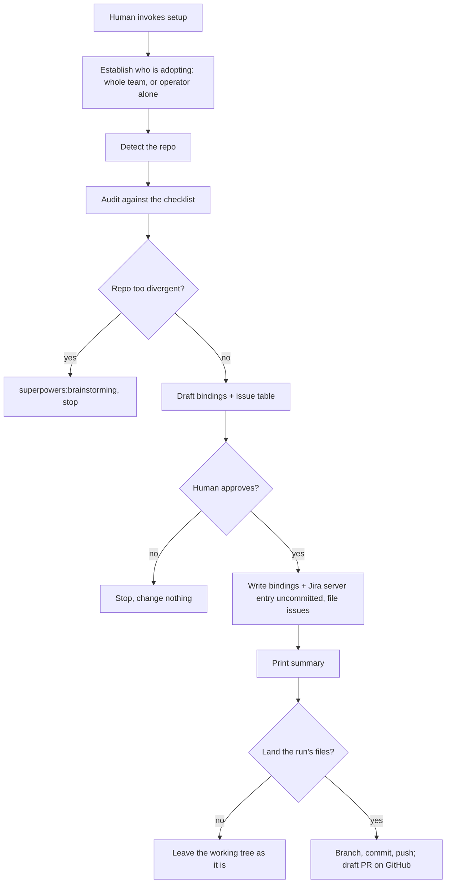

# Setting up a repo

Setup runs against the repo the session is in: first right after the
plugin is installed, then again whenever the plugin updates. A human starts
it; no other process invokes it. The repo is often not ours (a client's,
or another team's), and step 0 establishes whether the operator is a
guest.

Every run is idempotent, and re-running after a plugin update is how a repo
picks up what the update added: see [Re-running](#re-running).

The run produces:

- a `### Dev flow bindings` section in the repo's `CLAUDE.md`;
- under a Jira tracker with a recorded site, a `.mcp.json` Jira server
  entry at the repo root;
- one issue filed per remaining gap;
- a summary of everything, including what setup could not determine;
- an offer to land the files on a pushed branch, with a draft pull request
  on GitHub.

Nothing is written and nothing is filed before the human has seen what
setup proposes and approved it. Every file stays uncommitted until the
run's last question, [Land the run](#land-the-run).



## Write for the operator

The operator has not adopted these processes yet, and this run may be
their first contact with them. Every word for setup's own machinery
(*binding*, *entry*, *probe*, *candidate*, `unknown` as a state) is
foreign to them.

- **Gloss every term of art at first use** in a line setup prints or a
  question it asks, in the line itself. Name the thing in the repo's own
  terms, and the internal word second or not at all. Print an entry id
  with what it is.
- **Every question states a default that enter accepts.** An operator who
  knows the vocabulary clicks through as fast as without the glosses. A
  gloss lengthens a prompt and never adds a question, an answer or a stop.

The same reader governs what setup writes: the bindings section opens with
a sentence for a cold reader, and a filed issue argues on the repo's own
terms.

## 0. Establish who is adopting this

Ask one question, before reading anything:

```
Who is adopting this flow in this repo?

  team: this repo's whole team works through it; changes to the repo's
        own tooling are theirs to make and theirs to run.
  solo: only I have this tooling; the repo belongs to someone else, and
        I am a guest in it.

The answer decides what setup is allowed to file in this repo's tracker.
On team, every gap setup can file becomes an issue here. On solo, the gaps
that would commit this repo's owner to paying for an AI credential, or to
giving an agent write access here, are listed for you to raise with them
instead of filed on their behalf; everything else about the run is
identical.

(team / solo, enter accepts solo, which files less)
```

Ask it, and infer nothing: not from the remote's owner, push access or
anything else. A contractor with full write access to a client repo is
still a guest, and an employee working in a fork of their own team's repo
is not. No answer is `solo`, which files strictly less.

The answer changes one thing: which entries reach step 5's issue table.
On `solo`, an entry carrying `guest_filable: false` is held back and
reported under `Reported, not filed`. Everything else runs the same.

Done when the answer is `team` or `solo`.

## 1. Detect

Before anything is written, record the commit the run starts on, `git
rev-parse HEAD`, and the paths already changed in the working tree, `git
status --porcelain --untracked-files=all`. The flag lists each file inside
an untracked directory, where the default collapses it to `dir/` and a
file the run later writes there would match nothing. [Land the
run](#land-the-run) checks the base branch against the commit and marks
the changed paths.

Read [references/detect.md](references/detect.md) and resolve every
bindings row from the repo's own configuration. A value that cannot be
detected is `unknown`, never invented.

Done when every row holds a detected value, a carried-over value, or
`unknown`.

## 2. Audit

Read the bundled `checklist.json` beside this `SKILL.md`: the repo
artifacts these processes depend on. When it is absent, stop and say the
audit needs the full `apptension-sdlc` plugin or skill directory installed,
since the checklist cannot be rebuilt from this file. Render each entry's
`intent`, `grants` and `source` verbatim from the file.

Run each entry's `detect` probe against the repo and record `present`,
`candidate`, `missing` or `unknown`:

| `detect.kind` | Probe |
|---|---|
| `path` | Glob for the pattern |
| `matches` | Grep `detect.in` for the regex |
| `labels` | `gh label list`, compared per [audit.md](references/audit.md#labels-probes) |
| `heading` | Read `detect.in` and look for the heading |
| `board` | `gh project list` for the owner |
| `release_age` | Check in [references/release-age.md](references/release-age.md#check) |

Read [references/audit.md](references/audit.md) for the entry flags, the
`labels` rules, the `release_age` result and the project verification
discovery.

Check the plugins with `check-sdlc-plugins`'s `Check availability`. Its
stop result (the harness cannot list its own skills) does not stop setup:
report it in step 6, outside the groups, as a check that did not run. With
`check-sdlc-plugins` missing from the session, report the same line and say
`apptension-sdlc` has to be installed in this harness. A missing plugin is
session state, fixed by whoever runs the session, so it never becomes an
issue. Report it in step 6 on its own line with the line
`check-sdlc-plugins`'s `Install path for this harness` returns. A missing
plugin is not an escalation trigger and does not stop setup. Without
`superpowers`, `dev-flow` runs reduced mode, a weaker process the operator
should choose knowingly: say what it gives up, per `check-sdlc-plugins`.
When step 3 escalates without `superpowers:brainstorming`, it stops anyway.

Done when every entry has a state and every prerequisite is checked.

## 3. Escalate, or continue

Hand off to `superpowers:brainstorming` and stop when either holds, naming
the one that tripped:

- **No git remote at all.** There is no host, tracker or board to bind.
- **More than half the non-optional entries are `unknown`.** The audit
  learned too little to act on. A `candidate` does not count.

Without `superpowers:brainstorming` in the session, stop anyway: the
escalation is the stop. Name the condition, hand over what the run learned
(the values step 1 resolved and each checklist result, each named as what
it is), and say the rest is a conversation, not an audit.

These continue to step 4:

- A greenfield repo with no CI and no verification commands. Both rows are
  `unknown`, and `verification-workflow` files the gap.
- A non-GitHub host or tracker. The bindings record the deviation, the
  backlog prints, and nothing is filed.

Done when the run has escalated and stopped, or continues.

## 4. Compose the bindings

Compose the section; the gate releases it to disk. Writing here skips the
gate.

The target is `CLAUDE.md`, created if absent, or `AGENTS.md` when the repo
has that file and no `CLAUDE.md`.

| Existing section | Compose |
|---|---|
| None | Every reserved row, from the template in [references/bindings.md](references/bindings.md). A row the audit could not resolve gets the literal `unknown`, never omitted and never guessed: an absent row reads as "not needed" |
| Present | Update in place. Rows the audit resolved take the new value. Rows it could not resolve keep their value: downgrading a human-written value to `unknown` is a regression. A reserved row the section lacks is added, filled from the audit or `unknown`, which is how a repo bound by an earlier version catches up |

Under a Jira tracker, compose `.mcp.json` and the `.claude/settings.json`
approval key per [references/jira.md](references/jira.md#the-server-entry).

Done when the section is composed, and the server entry too where Jira
calls for one.

## 5. File one issue per gap

An entry is eligible for an issue when it is `missing`, carries neither
`writes:` nor `optional:`, and on `solo` is not `guest_filable: false`.
Every other entry is reported in step 6.

1. **Dedup and draft.** List open `repo-setup` issues and draft each
   eligible entry's body, per [references/issues.md](references/issues.md).
2. **Candidates.** Ask one question per candidate, per
   [audit.md](references/audit.md#candidates).
3. **Installers.** Ask the installer questions, per
   [references/installers.md](references/installers.md).
4. **The gate.** Read [references/gate.md](references/gate.md). Print the
   bindings, ask the rows it lists, then print the approve prompt. A
   non-GitHub tracker gets the bindings-only prompt and the backlog.

Nothing is written to the repo (no file, no label) and nothing is filed
before the human answers the approve prompt. Everything before it reads.

Every write the gate releases stops at the working tree: no `git add`, no
commit, no branch, no push. Landing is a separate question at
[Land the run](#land-the-run), asked once the run's last file is written:
the installers the gate releases have not written their files yet, and the
landing prompt names every file it commits.

On `yes`, run these approval items in order, and nothing else. Add every
path an item writes to [the run's file list](#the-runs-file-list).

1. Write the composed `### Dev flow bindings` section to its target file,
   uncommitted. This runs on every path, the deviation path included.
2. Only when step 4 composed a `.mcp.json`, write it to the repository root
   and write `enabledMcpjsonServers` into `.claude/settings.json`, both
   uncommitted. Step 4 composes none when the tracker is not Jira, the site
   is `unknown`, or an existing `.mcp.json` does not parse. A file present
   in the third case stays untouched, and the summary's `Written` group
   says so. This runs on `team` and `solo`: it commits nobody to a paid
   credential and grants no write scope.
3. Only under GitHub Issues, create the dedup label, once:

   ```bash
   gh label create repo-setup --description "Repository setup gap" || true
   ```

4. Only under GitHub Issues, run `gh issue create` for each approved row,
   in table order.
5. Run each queued installer in the order asked: `code-review-setup`, then
   `install-task-template`, then Configure in
   [references/release-age.md](references/release-age.md#configure).
   `install-task-template` is reached only under GitHub Issues. Each
   installer's own gate approves its writes.
6. When verification maintenance was approved, invoke
   `setup-verification-maintenance` with the approved configuration and
   rendered files. Reuse that approval when the files match; a changed
   proposal returns to the gate. Leave the install uncommitted.

Approval items 3 and 4 make no call against another tracker. Approval
items 5 and 6 write repo files under any tracker.

On `no`, nothing happens, and the run goes to step 6.

Done when the human has answered the approve prompt and, on `yes`, every
approval item that applies has run.

## 6. Summarise

Decide applicability before grouping. An entry whose precondition does not
hold in this repo is not applicable, and is reported nowhere. A probe
cannot express a precondition, so the skill declaring the entry states it,
and this step follows that skill. An entry declaring none applies
everywhere. Reporting a gap the repo's own answers rule out teaches the
operator to stop reading.

Report seven groups. Together they hold every applicable entry and every
bindings row, each in exactly one group:

| Group | What it holds |
|---|---|
| Present | Entries the audit found, plus candidates the human confirmed |
| Written | The bindings rows written, and to which file, plus the `.mcp.json` server entry, the site it points at, and the `.claude/settings.json` approval key where a Jira tracker released them. Then every path in [the run's file list](#the-runs-file-list), one per line, each machine-local path marked as staying on this machine |
| Filed | Issues created, with their numbers |
| Reported, not filed | Gaps that produced no issue: `optional:` entries found missing, entries `solo` held back, and rows the human dropped or declined |
| `unknown` | Entries whose probe did not run, and why, and separately the bindings rows step 1 could not resolve |
| Skipped as duplicate | Ids already open under `repo-setup`, with numbers |
| Candidates | Each one, and how the human resolved it |

Report any missing prerequisite plugin outside the groups, with its
install command. An `unknown` that never surfaces looks like a pass, and an
unreported `optional:` gap or `solo` hold-back is one the repo never hears
about.

Before printing, run what the gate released, in the gate's write order:

1. the E2E scaffold, when the gate named it: read
   [references/e2e.md](references/e2e.md);
2. the orchestrator, when the `Task orchestrator` row names one: read
   [references/orchestrator.md](references/orchestrator.md).

Print the summary per [references/summary.md](references/summary.md). Then
[land the run](#land-the-run).

Done when the summary is printed and the landing offer is resolved.

### Land the run

After the summary, offer to land the run's files on a branch with a draft
pull request. The offer is the run's last question.

The files are often the run's largest change, so they get a question of
their own. An orchestrator that commits at turn end also reaches
uncommitted files before the operator does, under a message that says
nothing. The prompt names the branch, the message and every file before
anything moves, and a `no` leaves the working tree and the remote exactly
as they are.

#### The run's file list

The list holds every path this run wrote, added as each write happens:

| Writer | Paths |
|---|---|
| Approval item 1, and the E2E row rewrites | The bindings file, `CLAUDE.md` or `AGENTS.md` |
| Approval item 2 | `.mcp.json` and `.claude/settings.json` |
| Approval items 5 and 6 | Each path `code-review-setup`, `install-task-template`, release-age Configure and `setup-verification-maintenance` report writing |
| The orchestrator | Each file `cezar-setup` reports writing |
| The E2E scaffold | Each path `e2e-setup` and `discover` report writing |

An installer's report is the source for its paths. A writer that left a
file unchanged, such as an installer that found its files current, adds
nothing.

A listed path that is a symlink (`test -L <path>`) is replaced by the file
it resolves to, relative to the repo root: the write lands in the target,
and git tracks the link, so committing the link stages nothing. A
`CLAUDE.md` linked to `AGENTS.md` lists `AGENTS.md`. A target outside the
repo is machine-local.

Split the list with `git check-ignore -q <path>`. An ignored path is
machine-local: the summary marks it as staying on this machine and the
offer leaves it out. `.ai/cezar/config.json` is the usual one.

#### When to offer

Offer when the list holds at least one path that is not machine-local. The
base branch resolves from `Branching model` by the rule `implement-issue`
uses for its workspace: a row naming a branch gives that branch, and an
absent row gives `Default branch`.

| Condition | Do |
|---|---|
| Nothing to land: the list is empty, or every path is machine-local | Print nothing more. A re-run that changed nothing ends at the summary |
| `Branching model` is `unknown` or names no branch, or the row is absent and `Default branch` is `unknown` | Skip the offer and say: "No base branch resolves from the bindings, so there is nothing to land on. The files above stay uncommitted." Name the row that blocked it: `Branching model`, or `Default branch` when `Branching model` is absent |
| No `origin` remote | Skip the offer and say: "This repo has no `origin` remote, so the files above stay uncommitted." |
| Otherwise | Print the prompt |

#### The prompt

```
Land what this run wrote on a branch with a draft pull request?

  branch  chore/repo-setup, cut from origin/main
  commit  chore: record dev flow bindings and add a task issue form
  files   CLAUDE.md
          .github/ISSUE_TEMPLATE/task.yml
  then    push to origin and open a draft pull request that links #42

Only these files go into the commit. Anything else in your working tree
stays as it is. .ai/cezar/config.json stays on this machine: git ignores it.

(yes / no, enter accepts no)
```

- **files**: every path, one per line, `.mcp.json` included where one was
  written. A teammate's Jira works only once `.mcp.json` lands, so it is
  never folded into a count. A path step 1 found already changed is
  marked, because the commit takes the whole file and the prompt shows
  names, not contents. A tracked file reads `(holds your changes from
  before this run; they are committed too, see git diff <run-start> --
  <path>)`. A file step 1 saw untracked reads `(was untracked before this
  run; all of it is committed, open the file to review it)`, since git
  holds no earlier copy to diff against.
- **branch**: `chore/repo-setup`. When that name exists, locally
  (`git rev-parse --verify --quiet refs/heads/chore/repo-setup`) or on
  `origin` (`git ls-remote --exit-code --heads origin chore/repo-setup`),
  `chore/repo-setup-<YYYY-MM-DD>`.
- **commit**: one subject in the `Commit convention` row's style, naming
  what landed: `chore: record dev flow bindings` plus a clause for what
  the installers added. A row that is `unknown` gets a plain imperative
  subject in sentence case.
- **then**: the issues the run filed, by number. A run that filed none
  drops the "that links" clause. When the `Code host` row is not GitHub,
  the line reads `push to origin; the pull request is yours to open`.

Enter accepts `no` here, where the gate accepts `yes`. This answer pushes
to a shared remote and opens a pull request others see, so the answer an
operator reaches by not deciding is the one that changes nothing.

On `no`, nothing changes and nothing more prints. The `Written` group has
already listed every file. On `yes`, read
[references/land-the-run.md](references/land-the-run.md) and follow it.

Done when the operator has answered `no`, the reference's last step has
run, or the offer was skipped with its line.

## Re-running

A re-run runs every step as a first run does. It audits against the
installed `checklist.json` and composes against the installed reserved
rows, so whatever the SDLC added since the last run surfaces as a gap:

| Since the last run | The re-run |
|---|---|
| Nothing changed | Reports everything present, writes nothing, files nothing, offers nothing to land |
| The SDLC reserved a new bindings row | Adds the row, from the audit or `unknown`, and keeps every existing value (step 4) |
| The SDLC added a checklist entry the repo lacks | Files one issue for it, or offers its installer (step 5) |
| An earlier run filed the gap | Skips it: dedup keys on the `repo-setup` marker (step 5) |
| The orchestrator configuration drifted from the bindings | Reconfigures it and reports which values moved ([orchestrator.md](references/orchestrator.md)) |
| One of the gate's four rows is still `unknown` | Asks it again at the gate |

The landing offer then covers exactly what the re-run wrote. A re-run after
a partial first run is how to resume one.

Moving a bound repo onto Jira takes a hand edit to `Issue tracker` first,
then the re-run: see [references/jira.md](references/jira.md#moving-a-bound-repo-onto-jira).

The `dev-flow-bindings` entry probes `CLAUDE.md`, so a repo whose bindings
went to `AGENTS.md` reports that entry `missing` on every run. The entry
carries `writes:`, so nothing is filed and the write stays idempotent. Read
that row against the target file step 4 chose before believing it.
